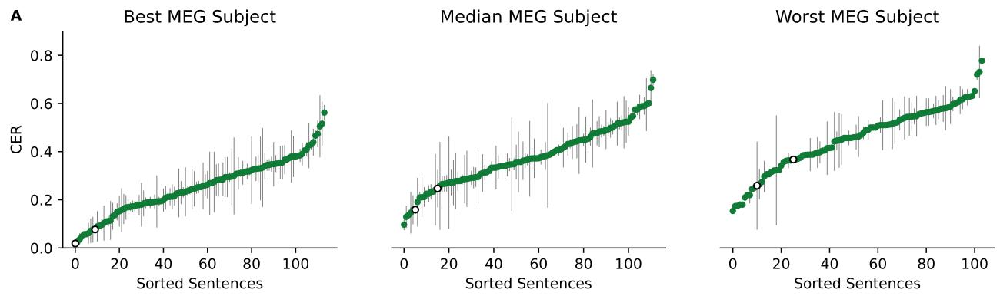
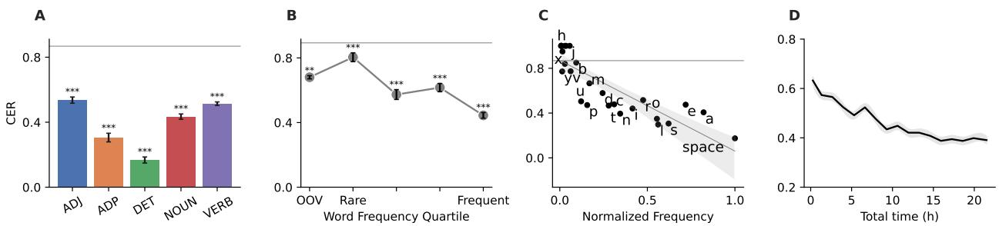
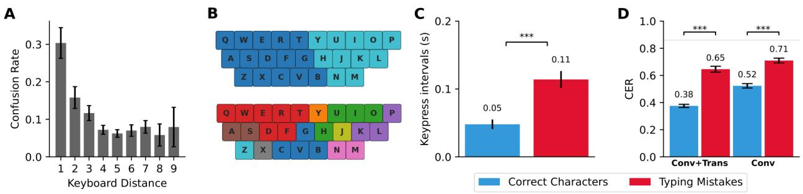
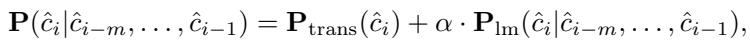

# Brain-to-Text Decoding: A Non-invasive Approach via Typing

Jarod Levy1， Mingfang(Lucy) Zhang2,3, Svetlana Pinet4,5, Jereémy Rapin1, Hubert Banvile1, Stephaned'Ascoli1\*， Jean-Remi King1

1Meta AI, ²Ecole Normale Supérieure, Université PSL, CNRS, 3Hospital Foundation Adolphe de Rothschild, 4Basque Center on Cognition, Brain and Language, San Sebastian, Ikerbasque, Basque Foundation for Science, Bilbao   
\*equal contribution

Moder neuroprostheses can now restore communication in patients who have lost the ability to speak or move. However, these invasive devices entail risks inherent to neurosurgery. Here, we introduce a non-invasive method to decode the production of sentences from brain activity and demonstrate its efficacy in a cohort of 35 healthy volunteers. For this, we present Brain2Qwerty, a new deep learning architecture trained to decode sentences from either electro- (EEG) or magneto-encephalography (MEG), while participants typed briefly memorized sentences on a QWERTY keyboard. With MEG, Brain2Qwerty reaches, on average, a character-error-rate (CER) of 32% and substantially outperforms EEG (CER: 67%). For the best participants, the model achieves a CER of 19%, and can perfectly decode a variety of sentences outside of the training set. While error analyses suggest that decoding depends on motor processes, the analysis of typographical errors suggests that it also involves higherlevel cognitive factors. Overall, these results narrow the gap between invasive and non-invasive methods and thus open the path for developing safe brain-computer interfaces for non-communicating patients.

Date: February 26, 2025 Correspondence: { jarod,sdascoli，jeanremi} @meta.com

  
Figure1 Approach. Recordings from 35 participants were obtained using electro-encephalography (EEG)and magnetoencephalography (MEG).Sentences were displayed word-by-wordon a screen.Folowing the final word,a visual cue prompted them to begin typing this sentence,without visual fedback.Our Brain2Qwerty model includes three core stages to decode text from brain activity: (1)a convolutional module,input with 500ms windows of M/EEG signals, (2)a transformer module trainedat thesentence level,and (3)apretrained language model tocorrect theoutputsof the transformer.Performance is assessed using a Character Eror Rate (CER)at the sentence level.An analysis of how the brain performs typing is described in a companion paper (Zhang et al. 2025).

# 1 Introduction

The past decade has been marked by rapid progress in brain-computer interfaces (BCIs) for individuals who, after a brain lesion, have lost their ability to speak or communicate. In particular,several patients sufring from anarthria (Metzger et al., 2022; Moses et al.， 2021)，Amyotrophic Lateral Sclerosis (ALS) （Wilett et al., 2023),or severe paralysis (Hochberg et al., 2O12) have now been able to produce fullsentences via a neuroprosthesis, which records and decodes neural activity from motor regions of the brain. Originall limited to decoding small sets of linguistic features (Herff et al.,2019; Angrick et al., 2019; Anumanchipali et al., 2019; Moses et al.,2021; Cardetal.,2024),words (Metzger etal.,2022),and gestures (Willettetal.,2021), the recent development of AI models has improved the precision and rapidity of brain-to-text decoding to a point of enabling natural language production at rates close to normal speech (Metzger et al., 2023; Wairagkar et al., 2024).

However, such invasive neuroprostheses require a neurosurgical procedure,and thus expose patients to nonnegligible risks of brain hemorrhage and infection (Chung et al., 2O19; Bullard et al., 2020; Leuthardt et al., 2021; Baranauskas, 2014). Additionaly, maintaining functional cortical implants over extended time periods remains chalenging (Fekete et al., 2023; Zhou et al., 2024; Yasar et al., 2024). As aresult,in their current form, invasive BCIs are not easily scalable for diagnosing or restoring communication in the large groups of non- or poorly-responsive patients (Owen et al., 2006; Claassen et al., 2019).

Non-inuasive BCIs could potentially address this challenge. However， they are usually based on scalp electroencephalography (EEG), whose limited signal-to-noise ratio (Mak and Wolpaw, 2009) requires users to perform complex tasks. For example,EEG-based BCIs typically require individuals to maintain their attention on flickering stimuli (Abiri et al., 2O19)or to imagine moving their hand or foot over long time periods (Bodien et al.,2024)-two tasks known to produce EEG patterns that can be relatively easily detected by a linear classifier. Even so,decoding performance remains moderate.For instance,a public BCI benchmark (Chevallier et al., 2024) using EEG achieves an accuracy of only 43.3% on a four-class clasification task with a motor imagery dataset (Yi et al.,2O14). In sum, current non-invasive methods fallshort of providing a fast and reliable BCI.

Two elements could address these challenges.First, magnetoencephalography (MEG), which measures the fuctations of magnetic fields elicited in the cortex,has higher signal-to-noise ratio than EEG (Hamalainen et al.,1993; Goldenholz et al., 2009; Baillet,2017).Second,deep learning models trained to reconstruct natural language from MEG signals in language comprehension paradigms have recently demonstrated major improvements,especially in comparison to EEG (Defossez et al., 2023).Together,these elements thus indicate that with modern AI techniques,high-quality MEG signals and natural language tasks could be combined to decode the production of language from non-invasive recordings of the brain.

In this study,we introduce Brain2Qwerty,an AI model trained to decode text production from non-invasive recordings of brain activity (Fig.1).For this,we tasked 35 participants to type briefly memorized sentences on a keyboard, while their brain activity was recorded with either EEG or MEG. We then train Brain2Qwerty, a three-stage deep neural network trained to decode text from these brain signals and evaluate it on both EEG (20 participants,146K characters, 23K words and 4K sentences) and MEG recordings (20 participants, 193K characters,30K words and 5K sentences). Note that the present study does not delve into how the brain produce language during typing. This neuroscientifc issue is addresed in a companion paper (Zhang et al., 2025).

# 2Results

# 2.1 Linear Decoding

To verify that our typing protocol leads to the expected brain responses,we first focus on the diferences in evoked responses elicited by left- and right-handed key presses (Fig. 2 A-B).The resulting topographies are typical of those associated with motor activity in the cortex (Donner et al., 2009). In addition, we trained a linear ridge classifier per subject to categorize left- vs right-handed responses at each time-sample relative to key presss.The classification accuracy peaks t=40ms after the key press (Fig.2). MEG achieves a peak accuracy of 74±1.3% (± reports standard-error-of-the-mean (SEM) across subjects)， significantly outperforming EEG which achieves 64±0.8% (Mann-Withney U test: p<10-7). We then trained the same model to classify the keys pressed. Character accuracy peaks around the same time, reaching a value of 22±0.8% for MEG and 16±0.5% for EEG,significantly above the chance level (14%). Overal, these findings confirm that the present protocol leads to the expected brain responses to key presses (Pinet and Nozari, 2020).

  
Figure2 Decoding Performance across models. A. Diference in EEG evoked responses between left vs right hand key preses.Each black line is the diferential voltage of a sensor relative to key press. B.Same as A but for MEG.C. Linear clasifiers are trained,at each time sample,to predict the leftvs right hand relative toeach key press.The gray linerepresents chance level and the error baris the standard errorof the mean across participants.Significant decoding Scores (p<O.05)are marked with a star.D.Same as Cbut for character clasification.E-H.Comparison of baselines (linear and EEGNet),and ablation of our thre-step Brain2Qwerty model (Conv+Trans+Language Model),for both hand-error-rate (HER)and character-error-rate (CER). Each point represents the average scoreof a single participant. Statistical significance is denoted with p < 0.05 (\*), p < 0.01 (\*\*), and p < 0.001 (\*\*\*).

# 2.2Brain2Qwerty Performance

We next trained Brain2Qwerty,a new deep learning architecture,to decode individual characters from these M/EEG signals (see Methods in section 4.2)and evaluated both the hands-error-rate (HER) and the character-error-rate (CER). Brain2Qwerty achieves a CER of 32±0.6% with MEG and 67±1.5% with EEG. This performance reflects a substantial difference across recording devices (p<10-8). The best and worst EEG subjects reach a CER of 61±2.0% acrosssentences and 71±2.3%,respectively. Similarly, the best and worst MEG subjects reach a CER of 19±1.1% and 45±1.2%,respectively.

# 2.3Comparing Brain2Qwerty to Baseline Models

How does Brain2Qwerty perform in comparison to classc baseline architectures? To address this issue we trained a linear model as wellas EEGNet-a popular architecture used in BCIs (Lawhern et al., 2O18)-with the same approach,and compared their decoding performance to Brain2Qwerty's with a Wilcoxon test across subjects (Fig. 2 E-H).EEGNet outperforms the linear model on both HER (p=0.008)and CER (p<10-4) for MEG - although only on HER for EEG (p=0.03).However, EEGNet remains less efective than our model, which achieves,in comparison,a 1.14-fold improvement in CER with EEG (p<10-5)and a 2.25-fold improvement for MEG (p<10-6),respectively.

# 2.4Brain2Qwerty Ablations

To validate our design choices, we then retrained diffrent ablated versions of our model. Specifically, we re-trained and evaluated (i) the Convolutional Module (i.e.no transformer, no language model) and (ii) the Conv+Transformer (i.e. without Language Model) with the same hyperparameters. The Convolutional

Module alone outperforms EEGNet both on EEG (HER: p=0.009, CER: p=0.03) and MEG (HER: p<10-5, CER: P<10-6). Adding the transformer only appears beneficial to CER, both for EEG (p<10-4) and MEG (p<10-6). Finally, the use of a Language Model module leads to an additional improvement of the CER of EEG (p<10-5） and MEG (p<10-6). Overal, these results show that the sentence-level contextualization provided by the transformer together with the leverage of natural language's statistical regularities efectively improves the decoding of individual characters.

B

# True: Best subject: Median subject: Worst subject:

LAS TEORIAS REDUCEN LOS NUMEROS LAS TEORIAS REDUCEN LOS NUMEROS LAS TEORIAS EXIGEN LOS HOMBROS LAS RANCIAS REVISEN LOS NUMERAD

True: Best subject: Median subject: Worst subject:

LA ESTADISTICA SIGUE LA DISTRIBUCION LA ESTADISTICA SIGUE LA DISTRIBUCION STAMISTOSA SIGUE LA DISTRIBUCION LA ESTADISTICA FIGURA DE PETRILLA LO

# Figure 3 Sentence-level performance for Best, Median and Worst MEG subjects.

A.Character-error-rate for three representative subjects.Each dot represents a unique sentence,with error bars indicating thestandard erorof the meanacross repetitions.Whitedots corresponds to the sentencesdisplayed below. B.Decoding predictions fortwo sentences. Several spliting seeds wereused to obtain the predictions across sentences.

# 2.5 Analyses of Decoded Sentences

The CER of allsentences for three representative participants recorded with MEG along with two example sentences from these subjects are displayed in Fig.3.More decoding examples show that several sentences can be perfectly decoded for MEG (Tab.1,right).Interestingly,some of these examples show that Brain2Qwertys language model can correct the typographical erors of the participant.For example,EL BENEFICIO SUPERA LOS RIESGOS was perfectly decoded,even though the participants typed: EK BENEFUCUI SYOERA KIS RUESGIS. In comparison, the poor EEG decoding (Tab.1,left)rarely leads to comprehensible text. Consistent with the statistical efects reported earlier,the examples in Tab.2 highlight the impact of each module of our model, which together leads to perfect decoding after the language model.

# 2.6Impact of Word Type and Frequency

To test whether Brain2Qwerty decodes words irrespectively of their grammatical type, we evaluated the CER for each part-of-speech (POS) categories separately (Fig. 4A).All POS categories are signifcantly better decoded than chance, with determiners exhibiting a remarkably low CER (17±1.9%). This phenomenon may be due to two factors: their short length and their high frequency. To formally test this hypothesis, we first analyzed the impact of word frequency on CER (Fig. 4B). The results confirm that frequent words are better decoded than rare words (p=10-7). Interestingly, we verify that the words absent from the training set (out-of-vocabulary, OOV) can also be decoded,although with a relatively poor CER (68±2.1%).Note that this may be due to the fact that on a random partition of train/validation/test splits,OOV words tend to be rare words.

Second, we evaluated whether the frequency of each character also impacts decoding. The results show a significant correlation between character frequency and decoding accuracy: R=0.85, p < 10-8 (Fig. 4C).

# EEG

# MEG

Read: LA CIENCIA DE LA IDEA ROMPE LA VISION Typed: LA CIENCIA DE LA IDEA ROMPE LA BISION DeCOde: LA CIENCIA DE LA IDEA LAS MAS DE ESOS Read: EL PROCESADOR EJECUTA LA INSTRUCCION Typed: ORDENADOR EJECUTA LA INSTRUCCION Decode: LAS CORRIDA PERITA LA INSTRUCCION Read: LA PRESENCIA DE LOS TIPOS IMPONE LOS RETOS Type: LA PRESENCIA DE LOS TIPOS IMPONE LOS RETOS DeCOde: LA DECLARADA DE LOS CELOS ERAN A LOS ACTOS

Read: LA SILLA OCASIONA LAS LESIONES Type: LA SILLA OCASIOMA LAS LESIOMES DeCOde: LA SILLA OCASIONA LAS LESIONES Read: LAS TEORIAS REDUCEN LOS NUMEROS Type: LAS TEORIAS REDUCEN LOS NUMEROS DeCOde: LAS TEORIAS REDUCEN LOS NUMEROS Read: EL BENEFICIO SUPERA LOS RIESGOS Type:EK BENEFUCUI SYQERA KIS RUESGIS DecOde: EL BENEFICIO SUPERA LOS RIESGOS

# Table 1 Examples of best-decoded sentences across subjects for EEG (left)and MEG (right) data.

Correct charactersare highlighted inblue,mistakes inred,and typing errors underlined.Note thatcorrect vs incorrect spaces are not visualized here.

Read: LAS TEORIAS REDUCEN LOS NUMEROS Typed: LAS TEORIAS REDUCEN LOS NUMEROS Conv: LAS TANGPAS RE UDNNDL SLINDIIS Conv+Trans: LAS GEOOLAS REDICEN LOS NUMEIOS Brain2Qwerty: LAS TEORIAS REDUCEN LOS NUMEROS

Read: ELBENEFICIO SUPERA LOS RIESGOS Typed: ELBEMEFICIO SUPERA LOS RIESFOS Conv: EL GEFEDISIO SUIERA NOA RIESTII Conv+Trans: EL GENEFICON CUPERA LOS RIESGOO Brain2Qwerty: EL BENEFICIO SUPERA LOS RIESGOS

# Table 2 Example of decoded sentences across ablations for MEG data. Color coding identical to Tab. 1.

Rare characters,such as "z," "k," and "w" in Spanish,are not decoded above chance level but only account for 0.08%,0.08%,and 0.05% of the characters in our sentences. These results suggest that the number of repetitions (of words and characters) encountered during training directly affects performance.

To confirm this,we explore how decoding performance scales with the amount of data.For this,we re-trained our model on uniformly sampled subsets of the training set (Fig. 4D). Our results show that CER decreases as a function of the amount of training data: R=0.93, p<10-7.

  
Figure 4 Analysis of character- and word-level performance.   
The results presented are specific to MEG data processed using the Conv+Trans model.A.Character-eror-rate (CER) is evaluated across diferent part-of-speech categories to evaluate how performance varies across adjectives (ADJ), nouns,verbs,determiners (DET),and prepositions (ADP). B.CER as a function of word frequency.Out-of-vocabulary (OOV)decoding is used to test whether Brain2Qwerty can decode words absent from the training set.C.CER as a function of character frequency. D.CER as a function of recording time included in the training set.

  
Figure 5 Impact of keyboard layout and typing errors.

The results presented are specific to MEG data processd using the Conv+Trans model. A. Keyboard Distance Effect. Confusion rate is analyzed against normalized keyboard distance.B.Clustering Analysis.K-means clustering of the model embeddings with 2(top)and 10 (bottom)clusters respectively.C.Keypress Intervals Analysis.Comparison of keypressinterval for correct keystrokes and typing errors,focusing on both preceding and subsequent characters. The sum of the two intervals is displayed. D.Typing Mistakes Performance Diferences.Performance comparison for correct characters versus typing errors using the Conv+Trans model (left） and the Conv model (right).

# 2.7 Impact of Keyboard Layout

If Brain2Qwerty relies on brain activity from the motor cortex (as opposed to some amodal representations of language), then we expect its decoding errors to relate to the specific layout of the QWERTY keyboard. To test this hypothesis,we evaluated the confusion patterns of incorrectly predicted characters by analyzing the keyboard distance between decoded and actual key presses. The results show a strong Pearson correlation between physical distance and confusion rate: R=0.73, p=0.02 (Fig. 5A). To complement this analysis, we further perform a clustering of the last-layer embeddings of the convolutional module using scikit-learn's K-means clustering algorithm. When trained on two clusters,this unsupervised model full separates the left-hand and right-hand keys. When using up to 10 clusters,the resulting partition remains consistent with the keyboard layout (Fig. 5B). This shows that the spatial layout of the keyboard is well encoded in the high-dimensional representations learned by our model. Overall,these results show that the decoder's mistakes tend to be confused with the keys that are physically close to the target letter on the QWERTY keyboard, suggesting that the decoder primarily relies on motor representations.

# 2.8 Impact of Typing Errors

Our protocol does not allw participants to correct their mistakes. Typing errors account for 3.9% of the keystrokes and are present in 65%of the sentences.Furthermore,they are asociated with a specific behavior (Fig. 5C): the time taken to type a character - as measured by the inter-key interval - doubles between correctly- (50±7ms) and incorrectly-typed characters (114±12 ms, p=10-7). This wel-nown phenomenon (Logan and Crump, 2010) likely reflects hesitation or monitoring of mistakes. To evaluate the impact of typing error on decoding performance, we separately evaluated CER for correctly- and incorrectly-typed characters (Fig. 5D). The results show that with our Conv+Trans model, correctly-typed characters lead to a beter CER (38%) than incorrectly-typed characters (65%, p=10-7). This result,however, may be partly driven by the contextualization enabled by the transformer.To minimize the impact of sentence context on this error analysis, we thus evaluate the performance of the Convolutional Module (Fig. 5D,right). Again, correctly-typed characters leads to a beter CER (52%) than incorrectly-typed characters (71%, p=10-7). This result suggests that decoding performance diminishes when motor processs are inaccurately executed.

# 3Discussion

The present study introduces a new method to decode the production of sentences from non-invasive brain recordings. With MEG,our Brain2Qwerty model achieves a character-error-rate (CER) of 32±0.6% on average across subjects, with the best-performing participants reaching a CER as low as 19%. Our analyses indicate that this decoding benefits from two main factors.First,the use of MEG signals instead of EEG signals resulted in a two-fold improvement.Second,our deep learning architecture,combined with a pretrained character-level language model, substantially outperforms standard models.

This work directly stems from the recent progress in decoding natural language from non-invasive recordings of brain activity. In particular,Defossez et al. (2023) showed that the perception of natural speech segments could be decoded, from MEG signals, with up to 41% top-10 accuracy (chance level=0.1%). Similarly, Tang et al. (2023)showed that the meaning of perceived sentences could be decoded from functional Magnetic Resonance Imaging (fMRI). Our Brain2Qwerty model shares several elements with these approaches, notably through the use of both a subject layer (Defossez et al., 2023) and the use of a language model (Tang et al, 2023),although here restricted to a pretrained 9-gram character-level model. However,these two studies, which focus on decoding the perception of language rather than its production,remained limited in their downstream clinical applications.

Studies that directly decode text production from non-invasive recordings remain rare.For example, Crell and Muller-Putz (2024) employed EEG to decode only 10 letters and achieved a character-error-rate of 75.8%,substantially higher than our 68% in the EEG setting with 29 characters. Similarly,EEG-based BCI benchmarks currently emphasize the constraints of poor signal quality and the variability across subjects (Chevaller et al.,2024). Our EEG fndings are consistent with these observations. Beyond its mere metric performance,our approach is more effcient than traditional protocols used in non-invasive BCIs,such as the P300-speler (Marchetti and Priftis, 2014),SSVEP (Cheng et al., 2002),and fMRI-localizer (Owen et al., 2006).These methods have historically relied on handcrafted signal processing and shallow clasifers. In contrast,our approach is based on a task that is comparatively easier to use.

While the decoding performance of Brain2Qwerty narrows the gap between non-invasive and invasive BCIs, this gap remains signifcant. In particular, for speech decoding, Metzger et al. (2O23) achieved a rate of 79 words per minute and reported a CER of 15.2% on a dataset with 372 unique words,a vocabulary size comparable to ours. Willett et al. (2021) demonstrated typing speeds of 90 characters per minute with a CER below 6% and an ofie CER under 1% when using a correction model. Both approaches rely on intracortical setups and require extensive recording sessions (11 hours per participant for Willett et al.(2021)). Consequently an important research avenue will be to scale and adapt those tasks for MEG experiments.

Several challenges remain to be solved before the present method could be adapted to clinical applications. First,our model does not operate in real time. In particular,the transformer and language model here operate at the sentence level and thus require the trial to conclude before an output can be produced. In addition, the input of Brain2Qwerty requires the MEG segments to be aligned to keystrokes.Overall,a real-time architecture,akin to what is done with electromyography (Sivakumar et al., 2024) and speech recognition (Defossez et al., 2023), remains necessary to make the present proof-of-concept applicable in real time.

Second,our study was conducted exclusively with healthy participants and with a strictly supervised model. Training indeed requires knowing both the timing and identity of each character. While this setup may be suitable for patients with neurodegenerative conditions who may still possess motor abilities,it is not applicable to locked-in individuals,who are completely unable to perform a typing task on a keyboard. Addressing this chalenge may involve either adapting our typing task into an imagination task or designing AI systems capable of robust generalization across participants (Scotti et al. 2024).

Finally, while MEG outperforms EEG,current MEG systems,including the one used in the present study,are not wearable.This,however,may be resolved by the development of new MEG sensors based on optically pumped magnetometers (OPMs) (Shah and Wakai, 2013; Schofield et al.,2022; Brickwedde et al., 2024).

Overall, the present results serve as a stepping stone toward developing safer and more accessible non-invasive brain-computer interfaces,ultimately enabling solutions for individuals who have partially or completely lost the ability to communicate.

# 4 Methods

We aim to decode language production from non-invasive brain recordings.To achieve this, participants typed sentences on a keyboard while their brain activity was recorded using EEG or MEG.These two devices

measure neural activity at a milisecond level, with EEG capturing electric felds and MEG detecting magnetic felds that are both generated by cortical neurons and recorded from sensors distributed across the scalp.

# 4.1Experimental Protocol

Cohort. We recruited 35 healthly adult volunteers to participate in our study at the Basque Center on Cognition, Brain and Language (BCBL) in Spain. This group was composed of 23% of men and 77% of women with an average age of 31.6±5.2 years.Al participants were right-handed and skiled at typing. Participants had to type words they were hearing on a keyboard covered by a cardboard box. They were selected if their typing accuracy was above or equal to 8O%. They are allnative Spanish speakers with no declared prior history of neurological or psychiatric disorders. Their brain activity was recorded with either EEG or MEG for 0.88±0.02 and 0.93±0.01 hours respectively,amounting to a total of 17.7 and 21.5 hours of typing. Five participants took part in both EEG and MEG sessions. One participant was excluded from the MEG study due to the presence of a metallic component during the recording. Participants gave their informed consent and werecompensated l2 euros per hour for their participation. This study was approved by the local ethics commitee. The same dataset is used to investigate the underlying neural mechanisms driving this task in a companion paper (Zhang et al., 2025).

Devices. The MEG system is a Megin system with 306 channels (102 magneto-meters and 204 planar gradiometers)recording at a sampling rate of 1kHz, with an online high-passfilter set at O.1 Hz and alow-pass filter at 330Hz. The EEG system is an actiCAP slim from BrainVision1,with 64 channels (61 EEG channels and 3 ocular channels),a BRAINAMP DC amplifer,and sampled at 1kHz with an online high-passflter set at 0.02 Hz.

Standard keyboards contain electronic and metalic parts that generate artifacts in the MEG. Consequently, we used a custom Magnetic-Resonance-compatible QWERTY keyboard from HybridMojo (LLC),and further modified it to replace the standard metallic springs with non-ferromagnetic silver-spring mechanisms.

Task.Participants were seated in front of a projected screen (100cm for MEG and 70cm for EEG away from their eyes),and with our custom keyboard placed on a stable platform. The distance between M/EEG sensors and the keyboard was 7Ocm. This setup ensured participants could type in a natural position. Each trial consisted of three steps: read, wait,type.First,a sentence was presented on the screen, with a rapid serial visual presentation protocol (RSVP;i.e. one word at a time). Each word was presented in a black font, in all upper-case,on a 50% gray background for a random duration between 465 and 665 ms without intervals between words. Second,after the disappearance of the last word of each sentence,a black fixation cross was displayed on the screen for 1.5 seconds. Third, the disappearance of the fixation cross signaled the start of the typing phase. No letters were presented on the screen during typing. Nevertheless, we added minimal visual fedback: a small black square at the center of the screen rotated clockwise by 10 degrees on every keystroke.This feedback ensured that eye movements were not corelated with linguistic features,as it is usually the case in left-to-right reading. Each session consisted of two blocks of 64 sentences each.The first four sentences of each sesson were training sentences and were different from the l28 unique sentences in the protocol. During the first two training sentences,participants received visual feedback while typing. The other two sentences were used to train them on the task (typing with minimal visual feedback).

Instruction and stimuli. Participants were instructed to type the sentence that was presented in RSVP as accurately as possble without using backspaces to correct errors and while fixating on the center of the screen. To avoid using diacritic marks that occur in Spanish (e.g.,é,á,i,ó, u, ü,and n),allwords were presented in upper case,and participants were instructed to think of writing in upper case,and without accents. Participants pressed the return key at the end of the trial. Each session consisted of 128 unique Spanish sentences. All sentences were declarative Spanish sentences that contained between 5 and 8 words. They consisted of determiners, nouns,adjectives, prepositions and verbs.This led to a total of 4K sentences and 146K characters across participants for EEG,and 5.1K sentences and 193K characters for MEG.

MEG and EEG preprocessing. In our pipeline, the EEG and MEG recordings were bandpass fltered between 0.1 and 20Hz, and resampled to 50Hz, using MNE-Python's default parameters (Gramfort et al., 2014). These continuous recordings were then segmented into 0.5 s time windows around each key pressfrom -0.2s to +0.3s.We applied baseline correction by subtracting the average channel-wise value in the (-0.2,O)interval from each window. To ensure that the data was on the same scale,a RobustScaler was applied across time from scikit-learn (Pedregosa et al., 2018)follwed by a clamping operation. The scaler removes the median and scales the data according to the interquantile range.

Text preprocessng.We removed sentences that contained strictly more than 10 typographical errors (less than 5% for both EEG and MEG). To determine whether the participants performed typographical errors, we frst used the SequenceMatcher from difflib ² to align the typed sentence to the original sentence using a Gestalt pattern matching algorithm (Ratcliff and Metzener,1988) that determines the minimal number of character-edits.This approach yields,for each keystroke event,two variables: the key pressed and the key that should have been pressd (target).Unless stated otherwise,allanalyses are based on the target key. On average, participants typed 152.0±3.2 characters per minute,leading to an average sentence production time of 5.7±0.2 s. 3.6 ± 0.7% of the keystrokes were typographical errors.

Train/validation/test splits. To ensure that our AI model does not memorize sentences, we divided the unique sentences into train (80%),validation (10%) and test splits (10%).As sentences may be similar (e.g. same sentence with an additional component)， we adopted a maximally diverse splitting strategy by implementing a custom data splitter based on sklearn's AgglomerativeClustering (Pedregosa et al., 2018). This method clusters unique sentences into groups of similar data points, where similarity is determined using Term Frequency-Inverse Document Frequency (TF-IDF) (Jones,l972) cosine similarity with a threshold of 0.5 (i.e.,sentences with a similarity score above 0.5 are grouped in the same split). These clusters are then assigned to the training,validation and testing splits with relative ratios of 80/10/i0. This approach prevents the model from artificially improving test performance by memorizing similar sentences across participants. Throughout the study, we presented our results using a fixed splitting seed, except in Fig. 3 where we evaluated performance across sentences.For this figure, we aggregated results from multiple models with diffrent splitting seeds to ensure broader sentence coverage, similar to a cross-validation approach.

# 4.2 Decoder

The goal for our decoding model is to predict each keystroke based on 0.5 s windows of M/EEG signals. Formally, the objective is to learn a mapping from brain recordings to class probabilities: f : Rsxt →[0,1]C, where srepresents the number of M/EEG sensors,t denotes the number of M/EEG time samples in the window,and C is the number of available keys.We consider C= 29 distinct classes, which include all the letters of the Latin alphabet as wellas three special classes: one for space,another for numbers,and the last for all other special characters.

# 4.2.1 Architecture

Our Brain2Qwerty model is composed of three successive modules (Fig. 1).

Convolutional Module.The frst building block is a modified convolutional model originally introduced by Defossez et al. (2023). This model consists offour main parts. The frst component employs a spatial attention mechanism to encode the relative positions of the sensors.The second introduces a subject-specific linear layer to account for differences between subjects. The third component is a convolutional neural network architecture,comprising 8 sequential blocks that employ a kernel size of 3and a dilation period of 3,and incorporate skip connections,dropout regularization,and GELU activation functions.Finally,the temporal dimension is pooled with a single-head self-attention layer. Thus,for each window X ∈ Rsxt, the CNN outputs Z ERʰ,with h = 2,048.For clarity,this module willhereafter be referred toas Convolutional Module (Conv).

Transformer Module. The outputs of the Convolutional Module are then input to a transformer Module (Trans). The receptive field of the transformer is restricted to a unique sentence: Z ∈Rn×h. The transformer is used to refine the keystroke predictions by exploiting contextual information and consists of 4 layers with 2 attention heads per layer,maintaining consistent input and output dimensions.Finaly,a linear layer projects the transformer's outputs to obtain the logits of each character Y ∈ Rn×C.

Language Model.Finaly,the output of the transformer Y is input to a language model, soas to leverage the statistical regularities of natural language. For this, we used a 9-gram character-level model constructed using the KenLM library (Heafield,2011) and pretrained on the Spanish Wikipedia Corpus (Wikimedia, 2005). This library optimizes both speed and memory effciency by employing a prefix tree structure. At inference time,the language model is input with a sequence of predicted characters,and causall predicts the most likely next character given the preceding predicted ones.

Formally, let i ∈[1,2,.,n] denote the positionof the character in a sequence of up to n characters and m = 9 be the order of the m-gram model. The probability of the next character i given its preceding predictions Ci-m,..,Ci-1 is estimated as a weighted combination between the transformer's logits and the probabilities of the language model:

wherePtrans(i)=log(sofmaxY)].)represents theontributionfromthecoremodel,Pim(ilci-.,) represents the probabilities from the language model, and α is the language model weight. We use a beam search of size 30 and a language model weight of 5 found using a grid search,ensuring a tradeoff between inference time and decoding accuracy. This language modeling module outputs a sequence of n characters that aim to regularize the predictions of the transformer with the statistics of natural language.Brain2Qwerty's final prediction is denoted as Y ∈ Rn×C.

# 4.2.2 Training

The Convolutional and Transformer modules are trained jointly with an unweighted crossentropy loss in an end-to-end manner across all subjects, with the same hyperparameters for EEG and MEG recordings. This leads to a total of \~400M parameters (258Mfor Conv,138M for Trans). The model is trained for 100 epochs with a batch size of 128 using the AdamW optimizer (Loshchilov and Huter,2019)with early stopping. We use the OneCycleLR scheduler (Smith and Topin, 2018) (weight decay=10-4; pct_start=0.1), warming up the learning rate to 10-4 over the first 10 epochs then decaying linearly. Training was conducted on a single NVIDIA Tesla V100 Volta GPU with 32 GB of memory. The total runtime for training one model is \~12 hours.

# 4.2.3 Evaluation

Hand Error Rate (HER). For analysis purposes and comparison with the clasic BCI literature (e.g. Lebedev and Nicolelis (2O06)), we first consider HER. This metric estimates whether the target and the predicted characters correspond to the same left/right-hand split of the keyboard. Specifically, keys to the left of Y,H,and Bare asigned to the left-hand category,while those to the right (including Y,H,and B) are assigned to the right-hand category.For this evaluation,special characters, numbers and space are excluded, as participants may use both hands to type them.

Character-error-rate (CER). CER is based on the Levenshtein distance which quantifies the minimum number of single-character edits required to transform the predicted sequence of keystrokes to the target sentence. A CERof0indicatesperfectcharacter-levelacuracy.Theformulafor CERisgivenbyCER=(s+d+) where s,d and a stand for substitutions, deletions,and additions in the n-character sentence,respectively. Unlesstated otherwise, we compute the CER at the sentence level using the Levenshtein³ python library, and report the average CER across sentences.

# 4.2.4Model comparison

Statistics.For statistical comparisons, we employed the non-parametric tests provided by the scipy package (Virtanen et al., 2020).For comparison across models within the same subjects, we used the Wilcoxon test. For comparison across subjects (e.g. for EEG versus MEG), we used the Mann Whitney U test. For time-course decoding, we further applied a false-discovery-rate (FDR) correction for multiple comparisons across time samples.

Baseline Models.We consider two baseline models. The first one is a linear model implemented using the RidgeClassifierCV function from the scikit-learn library (Pedregosa et al., 2018), which was trained to predict characters from a single time sample of recording for each subject separately. The regularization parameter α was selected through a nested cross-validation using a grid search logarithmic spanning from 10-2 to 108.This operation was repeated for each time sample between -0.5 and 0.5 seconds relative to the character onset.

As a second baseline, we need a model which uses the same setup as Brain2Qwerty,i.e. where all subjects are trained collectively and the temporal dimension is collpsed. We used EEGNet (Lawhern et al., 2018),a highly parameter-efficient model classcally used in BCIs. We trained EEGNet with the same approach as our model. For our experiments,EEGNet is configured with a depth of 6 and a dropout rate of 0.3,which were selected based on a grid search over the validation set.EEGNet does not incorporate a subject-specific linear layer, which may compromise its performance in this particular setup where all subjects were trained collectively.To compute the chance level while accounting for the imbalance across characters, we evaluated the performance of a dummy model that always predicts the most frequent character.

Companion paper.We explore how the brain produce a hierarchy of language representations in a companion paper (Zhang et al., 2025). Note that Fig.1 (left) and Fig. 2B are shared between these two studies.

# 5 Acknowledgments

The authors would like to thank Maite Kaltzakorta, Manex Lete, Jesi Jacobsen, Daniel Nieto, Jone Iraeta, Araitz Garnika, Jaione Bengoetxea, Natalia Louleli, Naroa Miralls, Enaut Zeberio, Craig Richter, Amets Esnal,and Olatz Andonegui,as well as Abhishek Charnalia and Pierre-Louis Xech for their critical help. This research is supported by the Basque Government through the BERC 2022-2025 program and Funded by the Spanish State Research Agency through BCBL Severo Ochoa excellence accreditation CEX2020- 001010/AEI/10.13039/501100011033.Parts of this research were carried within the European Union's Horizon 2020 research and innovation programme under the Marie Sklodowska-Curie grant agreement No 945304 - Cofund AI4theSciences hosted by PSL University.

References   
R.Abiri, S.Borhani,E. Selers,Y. Jiang,and X. Zhao.A comprehensive review of eeg-based brain-computer interface paradigms.Journal of Neural Engineering,16(1):011001,Feb 2019.doi:10.1088/1741-2552/aaf12e. https://doi.org/10.1088/1741-2552/aafl2e.   
M.Angrick,C.Herf, E. Mugler,M. C.Tate,M. W.Slutzky,D.J. Krusienski,and T.Schultz. Spech synthesis from ecog using denselyconnected3dconvolutionalneural networks.Journal of Neural Engineering,16(3):036019,Jun 2019. doi: 10.1088/1741-2552/ab0c59. https://doi.org/10.1088/1741-2552/ab0c59.   
G.K.Anumanchipali, J.Chartier,and E.F.Chang.Speech synthesis from neuraldecoding of spoken sentences.Nature, 568:493-498,2019. doi: 10.1038/s41586-019-1119-1. https://doi.0rg/10.1038/s41586-019-1119-1.   
S.Baillet.Magnetoencephalography for brain electrophysiologyand imaging.Nature Neuroscience,20:327-339,2017. doi: 10.1038/nn.4504. https: //doi.org/10.1038/nn.4504.   
G.Baranauskas.What limits the performance of curent invasive brain machine interfaces? Frontiers in Systems Neuroscience, 8:68,April 2014.   
Y.G.Bodien, J.Allanson,P.Cardone,et al.Cognitive motordissciation indisorders of consciousness.New England Journal of Medicine, 391(7):598-608,Aug 2024. doi: 10.1056/NEJMoa2400645. https: //doi.org/10.1056/ NEJMoa2400645.   
M.Brickwedde,P.Anders,A.A.Kihn,R.Lofredi,M.Holtkamp,A.M.Kaindl,T.Grent-'t Jong,P.Kruger,T.Sander, and P. J. Uhlhaas.Applications of opm-meg for translational neuroscience: a perspective.Translational Psychiatry, 14(1):341,Aug 2024. doi: 10.1038/s41398-024-03047-y. https://doi.org/10.1038/s41398-024-03047-y.   
A.Bullard,B.Hutchison,J.Lee,C.Chestek,and P.Patil.Estimating risk forfuture intracranial, fully implanted, modular neuroprosthetic systems: A systematic review of hardware complications in clinical deep brain stimulation and experimental human intracortical arays.Neuromodulation:Technology at the Neural Interface,23(4):411-426, 2020. IsSN 1094-7159. doi: 10.1111/ner.13069. https://doi.org/10.1111/ner.13069.   
N. S.Card,M. Wairagkar,C.Iacobaci, X. Hou,T.Singer-Clark,F.R. Wilett,E.M. Kunz,C.Fan,M. Vahdati Nia,   
D.R.Deo,A.Srinivasan,E.Y.Choi, M.F.Glaser,L.R. Hochberg,J.M. Henderson, K.Shahlaie,S.D.Stavisky,   
and D.M. Brandman. An accurate and rapidly calibrating speech neuroprosthesis. New England Journal of Medicine, 391(7):609-618, Aug 2024. doi: 10.1056/NEJMoa2314132. https://doi.org/10.1056/NEJMoa2314132.   
M.Cheng, X.Gao,S.Gao,and D.Xu. Design and implementation of abrain-computer interface with high transfer rates.IEEE Transactionson Biomedical Engineering,49(10):1181-1186,Oct 2002.doi:10.1109/tbme.2002.803536. https://doi.org/10.1109/tbme.2002.803536.   
S.Chevaller,I.Carrara,B.Aristimunha,P.Guetschel,S.Sedlar,B.Lopes,S.Velut,S.Khazem,andT.Moreau.The largest eeg-based bci reproducibility study for open science: the moabb benchmark, 2024. https://arxiv.org/ abs/2404.15319.   
J.E.Chung,H.R.Joo,J.L.Fan,D.F.Liu,A.H.Barnet,S.Chen,C.Geaghan-Breier,M.P.Karlsson,M.Karlsson, K.Y.Lee,H.Liang,J.F.Magland,J.A.Pebbles,A.C.Tooker,L.F.Greengard,V.M.Tolosa,andL.M.Frank. Highdensity,long-lasting,and multi-regionelectrophysiologicalrecordings using polmer electrode aays.Neuron,01(1): 21-31.e5, Jan 2019. doi: 10.1016/j.neuron.2018.11.002. https://doi.org/10.1016/j.neuron.2018.11.002.   
J. Classen,K.Doyle,A.Matory,C.Couch,K.Burger,A.Velazquez,J.Okonkwo,J.-R.King,S.Park,S.Agarwal, D.Roh,M.Megjhani,A.Eliseyev,E.Connoly,and B.Rohaut.Detectionof brain activation inunresponsive patients with acute brain injury.New England Journalof Medicine,380(26):2497-2505,2019.doi:10.1056/NEJMoa1812757. https://doi.org/10.1056/NEJMoal812757.   
M. Crelland G.Muller-Putz. Handwritten character classification from eeg through continuous kinematic decoding. Computers in Biology and Medicine,182:109132,2024.ISSN0010-4825.doi:10.1016/j.compbiomed.2024.109132. https://doi.org/10.1016/j.compbiomed.2024.109132.   
T. H. Donner, M. Siegel,P.Fries,and A. K.Engel. Buildup ofchoice-predictive activity in human motor cortex during perceptual decision making. Current Biology,19(18):1581-1585,Sep 2009.doi: 10.1016/j.cub.2009.07.066. https://doi.org/10.1016/j.cub.2009.07.066.   
A.Defossez, C. Caucheteux, J.Rapin, O.Kabeli,and J.-R.King.Decoding speech perception from non-invasive brain recordings.Nature Machine Inteligence, 5:1097-1107,2023.doi:10.1038/s42256-023-00714-5.https: //doi.org/10.1038/s42256-023-00714-5.   
Z.Fekete,A. Zatonyi,A.Kaszas,et al.Transparent neural interfaces: chalenges and solutions of microengineeed multimodal implants designed to measure intact neuronal populations using high-resolution electrophysiology and microscopy simultaneously. Microsystems  Nanoengineering, 9:66, 2023.doi: 10.1038/s41378-023-00519-x. https://doi.org/10.1038/s41378-023-00519-x.   
D.Goldenholz,S.Ahlfors,M.Hämalainen,D.Sharon,M. Ishitobi,L.Vaina,and S.Stuffebeam.Mapping the signal-to-noise ratios of cortical sources in magnetoencephalography and electroencephalography. Human Brain Mapping,30(4):1077-1086, 2009. doi: 10.1002/hbm.20571. https://doi.0rg/10.1002/hbm.20571.   
A.Gramfort,M.Luessi,E.Larson,D.A.Engemann,D.Strohmeier,C.Brodbeck,L.Parkonen,and M.S.Hamalainen. Mne software for procesing meg and eeg data. Neuroimage,86:446-460,Feb 2014. doi:10.1016/j.neuroimage.2013. 10.027. https://doi.org/10.1016/j.neuroimage.2013.10.027.   
K.Heafield.KenLM: Faster and smaller language model queries.In Chris Calison-Burch,Philipp Koehn, Christof Monz,and Omar F.Zaidan,editors,Procedings of the Sirth Workshop on Statistical Machine Translation,pages 187-197,Edinburgh,Scotland, July 2011.Asociation for ComputationalLinguistics. https://aclanthology. org/wl1-2123/.   
C. Herff, L. Diener, M. Angrick,E. Mugler, M. C.Tate, M. A. Goldrick,D.J. Krusienski, M. W.Slutzky,and T.Schultz.Generating natural, intellgible speech from brain activity in motor,premotor,and inferior frontal cortices.Frontiers in Neuroscience,13:1267,Nov 2019. doi:10.3389/fnins.2019.01267. https://doi.org/10. 3389/fnins.2019.01267.   
L. Hochberg,D.Bacher,B.Jarosiewicz,etal.Reach and graspby people with tetraplegia using a neuralycontroled robotic arm. Nature, 485:372-375, 2012. doi: 10.1038/naturel1076. https://doi.org/10.1038/nature11076.   
M.Hamalainen,R.Hari,R.Ilmoniemi,J.Knuutila,andO.Lounasmaa.Magnetoencephalography—theory,instrumentation,and applications to noninvasive studies of the working human brain.Reviews of Modern Physics,65(2): 413-497,1993. doi: 10.1103/RevModPhys.65.413. https://doi.org/10.1103/RevModPhys.65.413.   
S.Jones, K.A statistical interpretation of term specificity and its application inretrieval. Journalof Documentation, 28(1):11-21,1972.   
V. J.Lawhern,A. J. Solon, N.R. Waytowich, S. M. Gordon,C. P. Hung,and B.J. Lance.Eegnet: a compact convolutional neural network foreg-based brain-computer interfaces.Journal of Neural Enginering,15(5):056013, Oct 2018. doi: 10.1088/1741-2552/aace8c. https: //doi.org/10.1088/1741-2552/aace8c.   
M. A. Lebedevand M. A. Nicolelis. Brain-machine interfaces: past, present and future.Trends in Neurosciences, 29 (9):536-546, Sep 2006.doi: 10.1016/j.tins.2006.07.004. https://doi.org/10.1016/j.tins.2006.07.004.   
C.Leuthardt, D.Moran,W.,and T. Mullen. Defining surgical terminology and risk for brain-computer interface technologies.Frontiers in Neuroscience,15:599549,2021.doi:10.3389/fnins.2021.599549.https://doi.org/10 3389/fnins.2021.599549.   
G.D.Logan and M.J. C.Crump.Cognitive ilusions of authorship reveal hierarchical eror detection in skiled typists.Science,330(6004):683-686,2010. doi: 10.126/science.1190483.htps://doi.org/10.1126/science. 1190483.   
I. Loshchilov and F.Huter. Decoupled weight decay regularization,2019.https://arxiv.org/abs/1711.05101.   
J. Mak and J.Wolpaw. Clinical applications of brain-computer interfaces: current state and future prospects. IEEE Reviews in Biomedical Enginering, 2:187-199,2009.doi: 10.1109/RBME.2009.2035356.https://doi.org/10. 1109/RBME.2009.2035356.   
M.Marchetti and K.Priftis.Effectivenessof the p3-speler in brain-computer interfaces for amyotrophic lateral sclerosis patients: a systematic review and meta-analysis. Frontiers in Neuroengineering, 7:12, May 2014. doi: 10.3389/fneng.2014.00012. https://doi.org/10 .3389/fneng.2014.00012.   
S.L.Metzger,J.R.Liu,D.A.Moses,M.E.Dougherty,M.P.Seaton,K.T.Littlejohn,J.Chartier,G.K.Anumanchipalli, A.Tu-Chan,K.Ganguly,andE.F.Chang.Generalizable speling using aspeech neuroprosthesis inan individual with severe limband vocal paralysis.Nature Communications,13(1):6510,Nov 2022.doi:10.1038/s41467-022-3611-3. https://doi.0rg/10.1038/s41467-022-33611-3.   
S.L. Metzger,K.T.Littlejohn,A.B.Silva,D.A.Moses,M.P.Seaton,R.Wang,M.E. Dougherty,J.R.Liu, P. Wu,M. A. Berger, I. Zhuravleva, A. Tu-Chan, K. Ganguly， G. K. Anumanchipali， and E. F. Chang.A high-performance neuroprosthesis for speech decoding and avatar control.Nature,620(7976):1037-1046,Aug 2023. doi: i0.1038/s41586-023-06443-4. https: //doi.org/10.1038/s41586-023-06443-4.   
D.A. Moses,S.L.Metzger,J.R.Liu,G.K.Anumanchipali,J. G.Makin,P.F.Sun,J.Chartier,M.E. Dougherty,P.M. Liu, G.M. Abrams,A. Tu-Chan, K. Ganguly,and E.F. Chang. Neuroprosthesis fordecoding spech in a paralyzed person with anarthria.New England Journal of Medicine,385(3):217-227,Jul 2021.doi: 10.1056/NEJMoa2027540. https://doi.org/10.1056/NEJMoa2027540.   
A. M. Owen, M.R.Coleman, M. Boly, M. H. Davis, S. Laureys,and J. D.Pickard.Detecting awareness in the vegetative state. Science, 313(5792):1402,Sep 2006.doi: 10.1126/science.1130197.https://doi.org/10.1126/ science.1130197.   
F.Pedregosa, G.Varoquaux,A. Gramfort,V. Michel,B.Thirion,O.Grisel, M. Blondel,A. Muler,J.Nothman, G.Louppe,P.Pretenhofer,R. Weiss, V.Dubourg, J. Vanderplas,A.Passos,D.Cournapeau, M.Brucher,M.Perrot, and E.Duchesnay. Scikit-learn: Machine learning in python, 2018. https://arxiv.org/abs/1201.0490.   
S.Pinet and N.Nozari. Electrophysiological correlates of monitoring in typing with and without visual feedback. Journal of Cognitive Neuroscience,32(4):603-620,April 2020. doi: 10.1162/jocn_a_01500. https://doi.org/ 10.1162/jocn_a_01500.   
W.Ratclif, J.and E.Metzener,D.Pattern matching:The gestalt approach.Dr.Dobb's Journal, page 46, July 1988. https://www.drdobbs.com/database/pattern-matching-the-gestalt-approach/184407970? pgno=5.   
H. Schofield,E.Boto, V.Shah,R.M.Hill,J.Osborne,M.Rea,C.Doyle,N.Holmes,R.Bowtel,D.Woolger,nd M. J. Brookes. Quantum enabled functional neuroimaging: the why and how of magnetoencephalography using optically pumped magnetometers.Contemporary Physics,63(3):161-179,202doi:10.1080/00107514.2023.2182950. https://doi.org/10.1080/00107514.2023.2182950.   
S. Scoti, P.,M. Tripathy, K. T. Villanueva, C.,R. Kneeland,T. Chen,A. Narang,C. Santhirasegaran, J. Xu, T.Naselaris,A.Norman,K.,and M. Abraham,T. Mindeye2: Shared-subject models enable fmri-to-image with 1 hour of data, 2024. https://arxiv.org/abs/2403.11207.   
V. K. Shah and R. T.Wakai.A compact，high performance atomic magnetometer for biomedical applications. Physics in Medicine and Biology,58(22):8153-8161,Nov 2013.doi: 10.1088/0031-9155/58/22/8153.https: //doi.org/10.1088/0031-9155/58/22/8153.   
V.Sivakumar,J.Seely,A.Du,R. Bittner,S.,A.Berenzweig,A. Bolarinwa,A. Gramfort,and I. Mandel,M. emg2qwerty: A large dataset with baselines for touch typing using surface electromyography, 2024. https: //arxiv.org/abs/2410.20081.   
N.Smith,L.and N.Topin.Super-convergence: Very fast training of neural networks using large learning rates,2018. https://arxiv.org/abs/1708.07120.   
J.Tang,A. LeBel, S. Jain,and A. G. Huth. Semantic reconstruction of continuous language from non-invasive brain recordings. Nature Neuroscience,26(5):858-866, May 2023. doi: 10.1038/s41593-023-01304-9.https: //doi.org/10.1038/s41593-023-01304-9.   
P.Virtanen,R.Gommers,T. Oliphant,et al. Scipy 1.0: fundamentalalgorithms for scientificcomputing in python. Nature Methods,17(3):261-272,Feb 2020. doi: 10.1038/s41592-019-0686-2. http://dx.doi.org/10.1038/ s41592-019-0686-2.   
M.Wairagkar,N.S.Card,T.Singer-Clark,X.Hou, C.Iacobacci,L.R.Hochberg,D.M.Brandman,and S.D.Stavisky. An instantaneous voice synthesis neuroprosthesis,Sep 2024. https://doi.org/10.1101/2024.08.14.607690. bioRxiv [Preprint].   
Wikimedia. Wikimedia downloads, 2005. https: //dumps .wikimedia .org.   
F.R.Wilett,D.T.Avansino,L.R.Hochberg,J.M.Henderson,and K.V.Shenoy.High-performance brain-totext communicationvia handwriting.Nature,593(7858):249-254,May 2021.doi:10.1038/s41586-021-03506-2. https://doi.0rg/10.1038/s41586-021-03506-2.   
F.R.WilettE.M.Kunz,C.Fan,D.T.Avansino,G.H. Wilson,E.Y.Choi,F.Kamdar,M.F.Glasser,L.R.Hocherg, S.Druckmann,K.V.Shenoy,and J. M.Henderson.A high-performance speech neuroprosthesis.Nature,620(7976): 1031-1036,Aug 2023. doi: 10.1038/s41586-023-06377-x. htps://doi.org/10.1038/s41586-023-06377-x.   
T. Yasar,P.Gombkoto,A.Vysotski,et al. Months-long tracking of neuronal ensembles spanning multiple brain areas with ultra-flexible tentacle electrodes.Nature Communications,15:4822, 2024.doi: 10.1038/s41467-024-49226-9. https://doi.org/10.1038/s41467-024-49226-9.   
W. Yi, S. Qiu, K.Wang,H. Qi,L. Zhang,P. Zhou,F.He,and D.Ming.Evaluation of eeg oscilltory patterns and cognitive processduring simple and compound limb motor imagery. PLoS One, 9(12):el14853, Dec 2014. doi: 10.1371/journal.pone.0114853. https://doi.org/10.1371/journal.pone.0114853.   
M. Zhang,J.Levy,S.d'Ascoli,J.Rapin,F.-X.Alario,P.Bourdilon,S.Pinet,and J.-R.King.From thought toaction: How the hierarchy of neural dynamics supports language production. 2025.   
C. Zhou,Y.Tian,G.Li,etal.Through-polymer,viatechnology-enabled,fexible,lightweight,andintegrateddevices for implantable neural probes.Microsystems Nanoengineering,10:54,2024.doi: 10.1038/s41378-024-00691-8. https://doi.0rg/10.1038/s41378-024-00691-8.