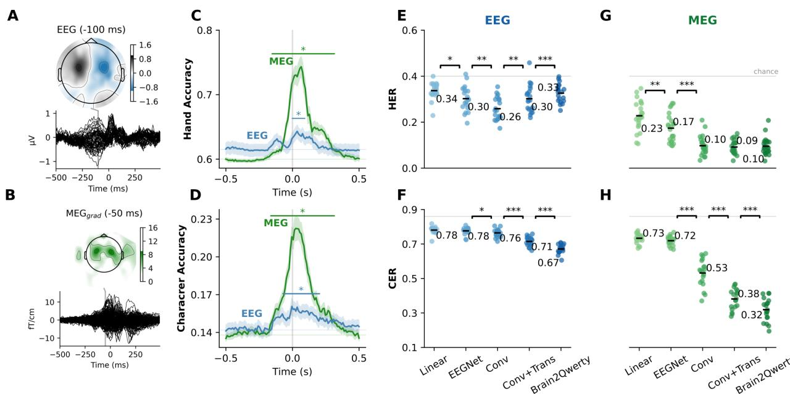

# Detailed Breakdown

## The Problem

Brain-computer interfaces (BCIs) for communication restoration face a critical dilemma: invasive methods achieve high performance but require dangerous neurosurgical procedures, while non-invasive methods are safe but suffer from poor signal quality and limited performance. Current invasive BCIs can achieve character-error-rates as low as 6-15% and typing speeds of 90 characters per minute, but they expose patients to significant risks including brain hemorrhage, infection, and long-term maintenance challenges. Conversely, traditional non-invasive EEG-based BCIs typically achieve only 43.3% accuracy on basic four-class classification tasks and require users to perform complex attention-demanding tasks like focusing on flickering stimuli or imagining movements.

The gap between invasive and non-invasive performance has prevented widespread adoption of BCIs for the large population of patients with communication disorders—including those with anarthria, ALS, stroke, or locked-in syndrome. Existing non-invasive methods fall far short of providing fast, reliable communication that approaches natural speech rates. This creates a critical need for safer alternatives that can bridge the performance gap while eliminating surgical risks.

## The Innovation

The Brain2Qwerty system introduces a fundamentally different approach by combining three key innovations:

- **MEG-based recording**: Utilizing magnetoencephalography's superior signal-to-noise ratio compared to EEG, achieving 2.25-fold better performance
- **Three-stage deep learning architecture**: Integrating convolutional neural networks, transformers, and language models to extract both motor patterns and linguistic context
- **Typing-based protocol**: Leveraging natural motor tasks that generate clear, detectable brain signals rather than artificial attention tasks

Unlike previous approaches that focused on decoding language perception or used limited character sets, Brain2Qwerty decodes full sentence production from 29 distinct character classes in real-world typing scenarios. The system achieves **32% average character-error-rate** with MEG and **67% with EEG**, with the best performing participants reaching **19% CER** with MEG—approaching invasive BCI performance without surgical risks.

The approach differs fundamentally from existing BCIs by focusing on motor-cortex activity during natural typing rather than attempted speech or imagined movements. This leverages the well-established brain representations for typing while avoiding the complex neural patterns of speech production that are harder to detect non-invasively.

## How It Works

The Brain2Qwerty system operates through a sophisticated three-stage pipeline:

1. **Signal Acquisition & Preprocessing**: Brain activity is recorded using either MEG (306 channels) or EEG (64 channels) while participants type memorized sentences. The system records 500ms windows around each keypress (-200ms to +300ms relative to key press). Signals are bandpass filtered between 0.1-20Hz, resampled to 50Hz, and normalized using robust scaling.

2. **Convolutional Module**: This modified CNN architecture processes the temporal brain signals through eight sequential blocks with kernel size 3 and dilation period 3. It incorporates spatial attention for sensor positioning, subject-specific linear layers to account for individual differences, and outputs 2,048-dimensional embeddings for each time window. This stage primarily extracts motor patterns related to hand movements and finger positioning.

3. **Transformer Module**: A 4-layer transformer with 2 attention heads per layer processes the sequence of embeddings at the sentence level. This allows the model to leverage contextual information across the entire sentence, improving character prediction by understanding grammatical and semantic relationships.

4. **Language Model Integration**: A pretrained 9-gram character-level language model (trained on Spanish Wikipedia) provides statistical regularization by predicting the most likely next character given previous predictions. The final output combines transformer logits with language model probabilities using beam search (size 30) and language model weight of 5.

The system uses a diverse sentence splitting strategy based on TF-IDF cosine similarity to prevent memorization, ensuring robust generalization to novel sentences. Training occurs across all subjects simultaneously with ~400M total parameters, requiring ~12 hours on a single NVIDIA Tesla V100 GPU.

## Key Results

The comprehensive evaluation across 35 healthy participants demonstrates substantial advances in non-invasive brain-to-text decoding:

- **MEG vs EEG performance**: MEG achieves **32% CER** vs EEG's **67% CER** (p<10^-8), representing a 2.25-fold improvement
- **Best subject performance**: Top participants reach **19% CER** with MEG, while worst-case participants still achieve 45% CER
- **Baseline comparisons**: Brain2Qwerty outperforms EEGNet by 1.14-fold (EEG) and 2.25-fold (MEG), and linear models by even larger margins
- **Component ablations**: Each module contributes significantly—Conv+Trans outperforms Conv alone, and adding the language model provides additional improvements (p<10^-6)
- **Out-of-vocabulary decoding**: The system can decode words not seen during training, though with reduced performance (68% CER vs 32% for in-vocabulary)
- **Word frequency effects**: Frequent words are decoded significantly better than rare words (p=10^-7), with determiners achieving particularly low 17% CER
- **Character frequency correlation**: Strong correlation between character frequency and decoding accuracy (R=0.85, p<10^-8)
- **Data scaling performance**: CER improves with more training data (R=0.93, p<10^-7), suggesting further gains with larger datasets

The system demonstrates perfect sentence decoding for many examples, including cases where the language model corrects participants' typing errors. For instance, when a participant typed "EK BENEFUCUI SYOERA KIS RUESGIS," the system correctly decoded "EL BENEFICIO SUPERA LOS RIESGOS."

## Practical Applications

### Medical Communication Restoration
Brain2Qwerty could serve patients with various communication disorders including stroke survivors, traumatic brain injury patients, individuals with ALS or other neurodegenerative diseases, and locked-in syndrome patients who retain some motor abilities. The non-invasive nature eliminates surgical risks while providing substantially better performance than previous non-invasive BCIs.

### Assistive Technology Integration
The technology could be integrated with existing assistive devices, creating hybrid systems that combine brain signals with residual motor capabilities. For patients with limited hand movement, partial typing combined with brain-based prediction could enhance communication speed and accuracy.

### Neurorehabilitation Monitoring
The system could potentially track recovery progress during rehabilitation by measuring brain activity patterns associated with attempted motor tasks, providing clinicians with objective measures of neural recovery.

### Research Applications
Beyond clinical use, the approach enables new research into the neural basis of language production, motor control, and the relationship between brain activity and typing behavior. The typing paradigm provides a controlled experimental setup for studying these cognitive processes.

## Limitations & Considerations

- **Non-real-time operation**: Current implementation requires sentence completion before output generation, making it unsuitable for real-time conversation
- **MEG accessibility**: MEG systems are not currently wearable or portable, though emerging optically pumped magnetometer (OPM) technology may address this limitation
- **Training requirements**: The model requires supervised training with known character timing and identity, making it unsuitable for completely locked-in patients who cannot perform typing tasks
- **Character frequency bias**: Performance correlates strongly with character and word frequency, potentially limiting utility for specialized vocabularies
- **Motor dependence**: The system relies on motor cortex activity, making it unsuitable for patients with complete motor paralysis
- **Language specificity**: Current implementation is trained on Spanish, requiring retraining for other languages
- **Hardware requirements**: Requires high-quality MEG systems and substantial computational resources (GPU training)

## What This Means for Builders

### Immediate Opportunities
Developers can begin implementing components of this architecture for research and specialized applications. The three-stage design provides a modular framework that can be adapted for different neural recording modalities beyond MEG/EEG, such as functional near-infrared spectroscopy (fNIRS) or emerging wearable neural sensors. The language model integration approach could enhance existing BCI systems across applications.

### Implementation Pathway
The architecture is implementable using standard deep learning frameworks and publicly available components. The convolutional and transformer modules can be built using PyTorch or TensorFlow, while the KenLM library provides efficient character-level language modeling. Training requires approximately 12 hours on a single high-end GPU for the full dataset, making it accessible to research laboratories and tech companies with standard AI infrastructure.

### Strategic Implications
This work suggests a fundamental shift in BCI development strategy toward hybrid approaches that combine multiple neural signal processing techniques with sophisticated language modeling. The success of motor-based typing paradigms indicates that focusing on well-understood neural processes may be more productive than attempting to decode complex cognitive states directly. The substantial gap between MEG and EEG performance underscores the importance of signal quality in neural decoding systems.

### Cost Optimization
While MEG systems are currently expensive, the superior performance (2.25-fold improvement over EEG) suggests that investing in higher-quality neural recording hardware provides substantial returns in decoding accuracy. The modular architecture allows for gradual implementation—beginning with the convolutional module and adding transformer and language model components as computational resources permit. For cost-sensitive applications, the EEG implementation, while less accurate, still provides functional communication capabilities at a fraction of the cost.