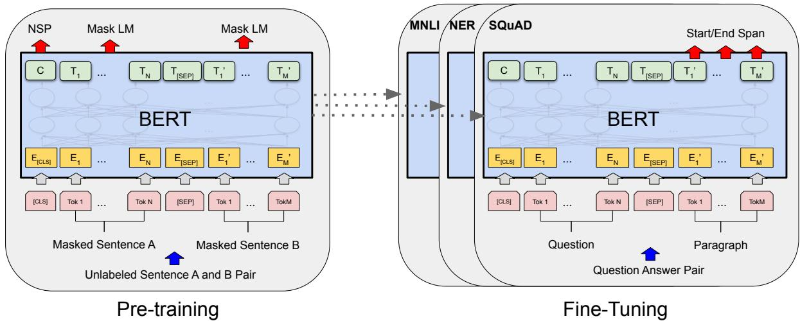
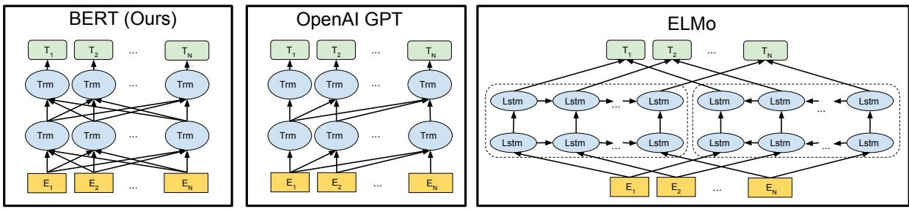
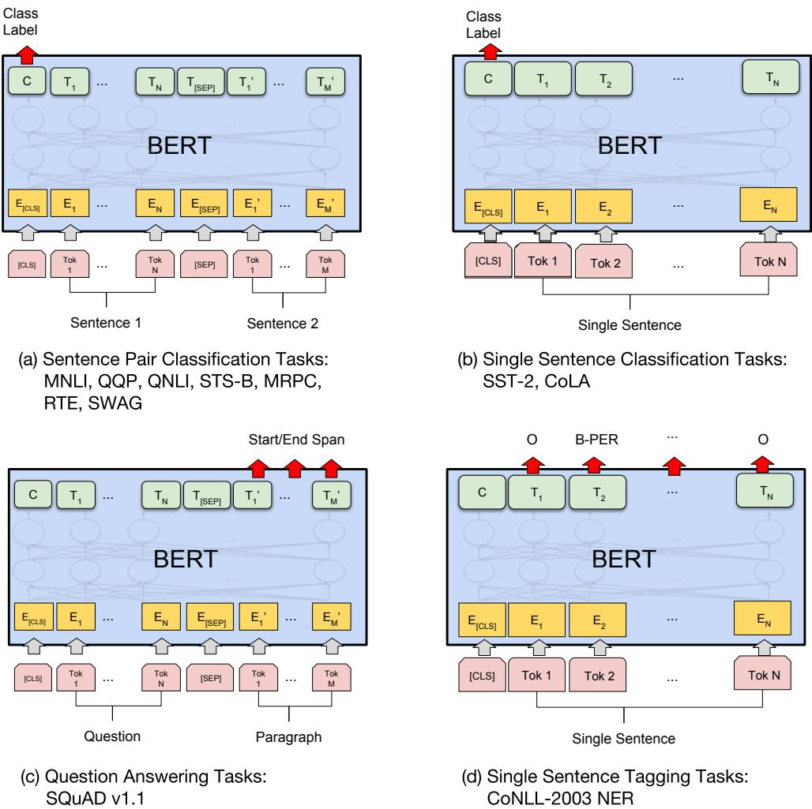

# Detailed Breakdown

## The Problem

Prior to BERT, language representation models suffered from fundamental limitations due to their unidirectional nature. Models like OpenAI GPT could only condition on left context when predicting words, severely restricting their ability to capture full contextual meaning. This limitation was particularly acute for token-level tasks such as question answering, where incorporating context from both directions is crucial for understanding relationships between questions and answers. Even feature-based approaches like ELMo, which combined left-to-right and right-to-left models, only provided shallow concatenation of independently trained representations rather than deep bidirectional understanding.

The technical challenge was that standard conditional language models couldn't be trained bidirectionally because allowing each word to "see itself" in the context would enable trivial predictions—models could simply copy the target word rather than learning meaningful representations. This created a fundamental barrier: deep bidirectional architectures were theoretically more powerful but practically impossible to train effectively using existing methodologies.

## The Innovation

BERT introduced two breakthrough innovations that resolved the bidirectional training problem:

- **Masked Language Model (MLM)**: Randomly masks 15% of input tokens and trains the model to predict the original vocabulary ID based solely on context, enabling true bidirectional learning without the trivial prediction problem
- **Next Sentence Prediction (NSP)**: Jointly pre-trains text-pair representations by training the model to predict whether sentence B logically follows sentence A, capturing relationships crucial for tasks like question answering and natural language inference

Unlike previous approaches that either used unidirectional models (GPT) or shallow concatenation of separate left/right models (ELMo), BERT achieves deep bidirectional representation where every layer can condition on context from both directions simultaneously. This is accomplished through a sophisticated masking strategy: 80% of masked tokens are replaced with [MASK], 10% with random tokens, and 10% are left unchanged, reducing the mismatch between pre-training and fine-tuning while maintaining the model's ability to learn contextual representations.

## How It Works

**Architecture**: BERT uses a multi-layer bidirectional Transformer encoder with two main configurations: BERTBASE (12 layers, 768 hidden units, 12 attention heads, 110M parameters) and BERTLARGE (24 layers, 1024 hidden units, 16 attention heads, 340M parameters). The model uses WordPiece embeddings with a 30,000 token vocabulary and incorporates special tokens: [CLS] for classification tasks and [SEP] for separating sentence pairs.

**Input Representation**: Each token's input embedding is constructed by summing three components: token embeddings (WordPiece), segment embeddings (indicating sentence A vs B), and position embeddings. This allows BERT to handle both single sentences and sentence pairs within the same architecture, making it adaptable to diverse downstream tasks.

**Training Process**: BERT is pre-trained on 3.3 billion words from BooksCorpus (800M words) and English Wikipedia (2,500M words) for 1,000,000 steps with a batch size of 256 sequences. The training uses Adam optimizer with learning rate 1e-4, β1=0.9, β2=0.999, L2 weight decay of 0.01, and linear learning rate decay with warmup.

**Fine-tuning**: For downstream tasks, BERT requires minimal architectural changes. The same pre-trained parameters are used to initialize task-specific models, and all parameters are fine-tuned end-to-end. Only additional output layers are added: classification layers for sentence-level tasks and token-level classifiers for sequence tagging tasks.

## Key Results

BERT achieved state-of-the-art results across 11 natural language processing tasks:

- **GLUE score of 80.5%** (7.7% absolute improvement over previous state-of-the-art)
- **MultiNLI accuracy of 86.7%** (4.6% absolute improvement)
- **SQuAD v1.1 F1 score of 93.2** (1.5 point absolute improvement)
- **SQuAD v2.0 F1 score of 83.1** (5.1 point absolute improvement)
- **SWAG accuracy of 86.3%** (27.1% improvement over baseline ESIM+ELMo)

The evaluation setup included diverse datasets: GLUE (9 tasks), SQuAD v1.1 (100k question-answer pairs), SQuAD v2.0 (with unanswerable questions), and SWAG (113k commonsense inference examples). Notably, BERTLARGE significantly outperformed BERTBASE across all tasks, especially those with limited training data, demonstrating the effectiveness of large-scale pre-training.

Ablation studies confirmed the importance of both pre-training tasks: removing NSP hurt performance on QNLI, MNLI, and SQuAD, while using unidirectional training (like GPT) resulted in substantial performance drops, especially on MRPC (from 86.7% to 77.5%) and SQuAD (from 88.5% to 77.8%).

## Practical Applications

### Question Answering Systems
BERT's ability to understand relationships between questions and context passages enables more accurate extraction of answers from documents. The bidirectional understanding allows models to match questions with answer spans that depend on context from both directions.

### Natural Language Inference
By understanding sentence relationships through NSP pre-training, BERT excels at determining logical relationships between premise and hypothesis pairs, enabling applications in content moderation, fact-checking, and semantic search.

### Named Entity Recognition
BERT's contextual token representations improve identification of entities like people, organizations, and locations within text. The model achieves 92.8 F1 on CoNLL-2003 NER task, competitive with state-of-the-art systems.

### Sentiment Analysis
For classification tasks like sentiment analysis, BERT's [CLS] token representation provides superior sequence-level understanding, achieving 94.9% accuracy on SST-2 dataset.

### Paraphrase Detection
BERT's ability to understand semantic similarity enables effective identification of paraphrases and duplicate content, useful for content deduplication and information retrieval.

## Limitations & Considerations

- **Computational Cost**: BERTLARGE requires 16 Cloud TPUs and 4 days for pre-training, making it expensive to reproduce from scratch
- **Memory Requirements**: The large model sizes (110M for BERTBASE, 340M for BERTLARGE) require significant GPU memory for fine-tuning
- **Sequence Length Limitation**: Maximum input sequence length of 512 tokens restricts processing of very long documents
- **Pre-training/Fine-tuning Mismatch**: The [MASK] token used during pre-training doesn't appear during fine-tuning, requiring sophisticated masking strategies
- **Language Specificity**: BERT was trained primarily on English text, requiring separate pre-training for other languages

## What This Means for Builders

### Immediate Opportunities

Developers can now achieve state-of-the-art performance on NLP tasks with minimal effort by fine-tuning pre-trained BERT models. The unified architecture means the same model can be adapted for diverse applications from chatbots to document analysis, dramatically reducing development time. Google has made both the code and pre-trained models publicly available, enabling immediate adoption across industries.

### Implementation Pathway

Implementing BERT is straightforward: download pre-trained models from the official GitHub repository, add task-specific output layers, and fine-tune on labeled data. Fine-tuning typically requires only 2-4 epochs with learning rates between 2e-5 and 5e-5, taking as little as 1 hour on a single Cloud TPU or a few hours on GPUs. The feature-based approach also allows using BERT as a fixed feature extractor, beneficial when computational resources are limited.

### Strategic Implications

BERT represents a paradigm shift from task-specific architectures to universal pre-trained representations. This trend toward transfer learning in NLP suggests future applications will be built by fine-tuning large foundation models rather than training from scratch. Companies should invest in understanding how to adapt pre-trained models rather than building bespoke architectures, focusing on data quality and domain-specific fine-tuning strategies.

### Cost Optimization

While pre-training BERT from scratch is expensive, fine-tuning pre-trained models is relatively inexpensive and provides excellent ROI. The ability to use one model across multiple tasks reduces infrastructure and maintenance costs. Feature-based approaches can further reduce inference costs by pre-computing BERT representations and using lighter models for downstream tasks, enabling scalable deployment in production environments.