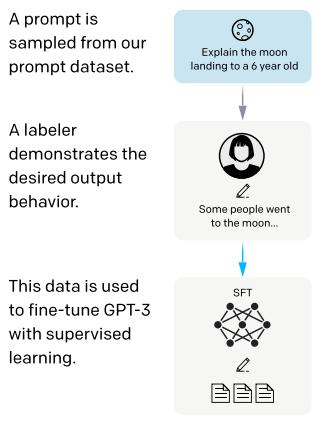
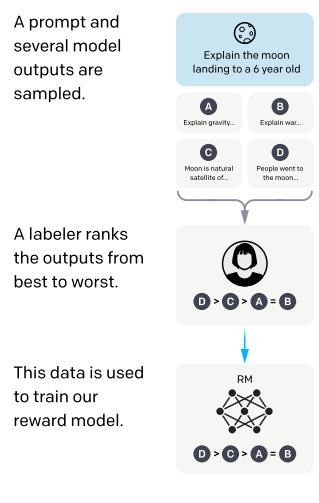
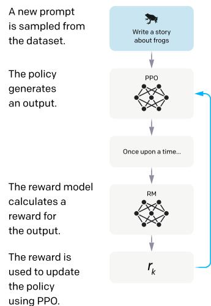

# Detailed Breakdown

## The Problem

Large language models (LLMs) trained on next-word prediction objectives from internet text exhibit significant misalignment with user needs. These models frequently generate untruthful content, toxic or biased outputs, and fail to follow user instructions reliably. The core challenge is that predicting the next token on webpages is fundamentally different from the objective "follow the user's instructions helpfully and safely." This misalignment creates risks when models are deployed in hundreds of real-world applications, including generating misinformation, producing harmful content, and failing to provide useful assistance to users.

Traditional approaches of simply scaling model size have proven insufficient to address these behavioral issues. While larger models like GPT-3 (175B parameters) show improved capabilities, they still express unintended behaviors such as making up facts, generating biased text, or simply not following user instructions. The misalignment problem becomes particularly critical for safety-critical applications where reliability and trustworthiness are essential.

## The Innovation

InstructGPT introduces a systematic approach to aligning language models with human intentions using reinforcement learning from human feedback (RLHF). This represents a fundamental departure from previous alignment techniques in several key ways:

- **Multi-stage alignment process**: Combines supervised learning on human demonstrations with reinforcement learning using a learned reward model, creating a more robust alignment signal than either method alone
- **Broad task coverage**: Unlike previous work focused on single tasks like summarization, this method trains models to follow a wide variety of instructions across different domains and use cases
- **Efficient parameter usage**: Demonstrates that smaller models (1.3B parameters) can outperform much larger models (175B parameters) when properly aligned with human preferences

The approach differs from existing instruction-following methods like FLAN and T0, which rely on fine-tuning on collections of public NLP tasks. InstructGPT uses real user prompts from the OpenAI API, which better reflect actual usage patterns and include more diverse tasks like creative writing, brainstorming, and open-ended generation that are underrepresented in public datasets.

## How It Works

The InstructGPT training methodology consists of three distinct stages:



1. **Supervised Fine-Tuning (SFT)**: Human labelers provide demonstrations of desired behavior on input prompts from the OpenAI API and labeler-written examples. Researchers fine-tune a pretrained GPT-3 model on this demonstration data using supervised learning for 16 epochs with cosine learning rate decay and 0.2 dropout. This creates an initial model that understands instruction-following behavior.



2. **Reward Model (RM) Training**: Researchers collect a dataset of comparisons between model outputs where labelers indicate their preferences. Starting from the SFT model with the final unembedding layer removed, they train a 6B parameter model to output scalar rewards predicting human preferences. The RM uses a cross-entropy loss where the difference in rewards represents the log odds that one response will be preferred over another.



3. **Reinforcement Learning with PPO**: The SFT model is fine-tuned using Proximal Policy Optimization (PPO) with the RM providing reward signals. The environment presents random customer prompts and expects responses, ending each episode after generating the response. To prevent over-optimization, researchers add a per-token KL penalty from the SFT model. They also experiment with mixing pretraining gradients (PPO-ptx) to mitigate performance regressions on public NLP datasets, maximizing the combined objective:
   ```
   objective(φ) = E(x,y)∼DRL[RMφ(x,y) - β·KL[πφRL|πSFT]] - γ·E(x,y)∼Dpretrain[log πφRL(y|x)]
   ```

## Key Results

The evaluation demonstrates significant improvements across multiple dimensions:

- **Human preference superiority**: 175B InstructGPT outputs are preferred to GPT-3 outputs **85 ± 3%** of the time, and **71 ± 4%** over few-shot GPT-3. Remarkably, the 1.3B InstructGPT model is preferred to the 175B GPT-3 despite having over 100x fewer parameters.

- **Truthfulness improvements**: On the TruthfulQA benchmark, InstructGPT generates truthful and informative answers about **twice as often** as GPT-3. On closed-domain tasks, hallucination rates drop from 41% for GPT-3 to 21% for InstructGPT.

- **Toxicity reduction**: When prompted to be respectful, InstructGPT models generate approximately **25% fewer** toxic outputs than GPT-3 according to both automatic evaluations (Perspective API) and human judgments.

- **Generalization capabilities**: InstructGPT demonstrates ability to follow instructions in different languages, summarize and answer questions about code, and handle tasks outside the RLHF fine-tuning distribution, suggesting models generalize the concept of "following instructions."

- **Efficiency advantage**: The method significantly outperforms alternatives like FLAN and T0 that use public NLP task datasets, with InstructGPT achieving 73.4 ± 2% winrate versus baseline, compared to 26.8 ± 2% for T0 and 29.8 ± 2% for FLAN.


## Practical Applications

### Customer Service and Support
InstructGPT's improved instruction-following and truthfulness make it ideal for customer service applications where accurate, helpful responses are critical. The reduced hallucination rate (21% vs 41%) means customers receive more reliable information.

### Content Creation and Creative Writing
The models' ability to follow complex instructions and generate appropriate content across different styles and domains enables more sophisticated content creation tools. They can handle brainstorming, story writing, and creative tasks with better adherence to user constraints.

### Educational Applications
Improved truthfulness and reduced toxicity make InstructGPT suitable for educational settings where accurate information and appropriate content are essential. The models can serve as tutoring assistants or educational content generators.

### Software Development and Code
Demonstrated ability to understand and explain code, answer programming questions, and follow technical instructions enables applications in software development, documentation generation, and programming education.

### Business and Professional Applications
The models can handle professional tasks like summarization, classification, and information extraction with improved reliability, making them suitable for business intelligence, document analysis, and workflow automation.

## Limitations & Considerations

- **Labeler bias**: Models are aligned to preferences of approximately 40 contractors who are primarily English-speaking, not representative of all users who will be affected by deployed models.

- **Remaining safety issues**: Models still generate toxic or biased outputs, make up facts, and produce sexual/violent content without explicit prompting. They may follow harmful user instructions without refusal.

- **Performance regressions**: Initial RLHF training caused performance drops on some public NLP datasets (SQuAD, DROP, HellaSwag, WMT translation), though the PPO-ptx approach mitigated many of these regressions.

- **Simple mistakes persist**: Models still fail with false premises, over-hedge simple questions, and struggle with multiple explicit constraints in instructions.

- **Limited adversarial robustness**: Performance degrades on adversarially selected inputs, and models may not handle edge cases or novel situations reliably.

- **Context-dependent harm**: Determining whether outputs are harmful depends on deployment context, making it challenging to create universally safe models.

## What This Means for Builders

### Immediate Opportunities

Developers can now deploy smaller, more efficient language models that outperform larger alternatives on user satisfaction metrics. The 1.3B InstructGPT model's superior performance over 175B GPT-3 demonstrates that alignment quality matters more than parameter count for practical applications. This enables cost-effective deployment of high-quality language models in resource-constrained environments while maintaining or improving user experience.

### Implementation Pathway

The three-stage RLHF approach is accessible to organizations with moderate ML capabilities. Companies can implement this methodology using existing open-source tools and human labeling platforms. The process requires: (1) collecting demonstration data for supervised fine-tuning, (2) gathering preference comparisons for reward model training, and (3) implementing PPO reinforcement learning with appropriate KL penalties. Pre-trained models can serve as starting points, significantly reducing computational requirements compared to training from scratch.

### Strategic Implications

This research signals a fundamental shift in AI development from scaling-focused approaches to alignment-focused methodologies. Organizations that prioritize human alignment and user experience over raw model size will likely achieve better outcomes with lower costs. The finding that public NLP datasets don't reflect real usage patterns suggests companies should focus on collecting data from actual user interactions rather than relying solely on academic benchmarks.

### Cost Optimization

The dramatic efficiency gains (100x parameter reduction while improving performance) represent substantial cost savings for inference deployment. Organizations can serve high-quality instruction-following models with significantly reduced computational resources, enabling broader accessibility and lower operational costs. The alignment tax (performance regression on some tasks) can be mitigated through pretraining gradient mixing, allowing companies to maintain performance on specialized tasks while improving general instruction-following capabilities.