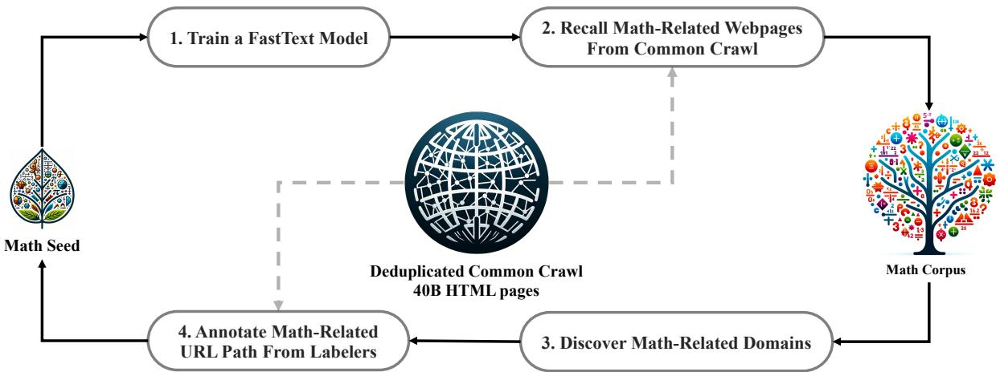
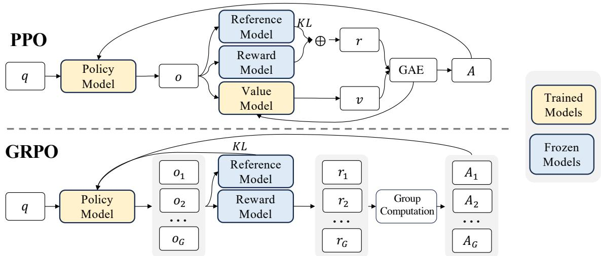
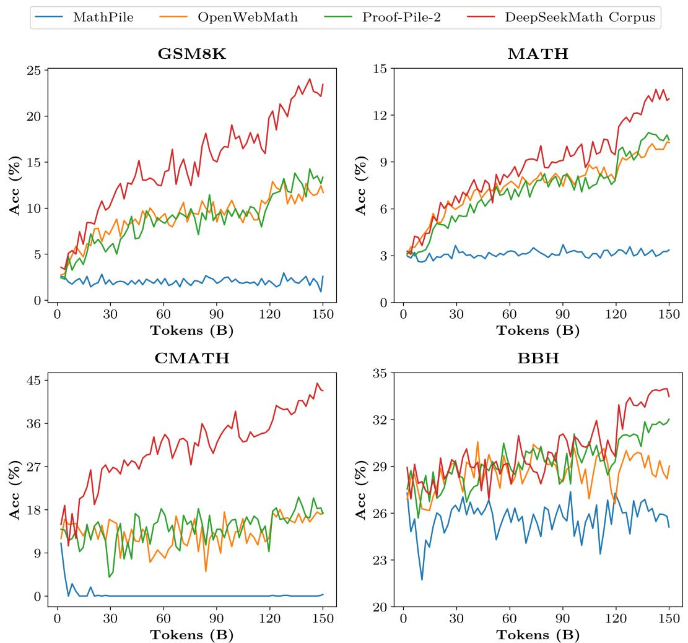

# Detailed Breakdown

## The Problem

Mathematical reasoning represents one of the most complex challenges for large language models due to its structured, logical nature and requirement for precise step-by-step thinking. While closed-source models like GPT-4 and Gemini-Ultra achieve impressive performance on mathematical benchmarks, they remain inaccessible to the research community. Open-source models significantly lag behind, creating a substantial gap between what's theoretically possible and what's practically available for research, education, and development. This disparity hinders progress in mathematical AI research and limits the development of educational applications that could benefit from advanced mathematical reasoning capabilities.

The specific challenges include: the need for diverse mathematical training data spanning different languages and complexity levels, the high computational cost of training specialized mathematical models, and the difficulty of optimizing language models for precise logical reasoning rather than general language understanding. Existing open-source mathematical models like Llemma 34B and InternLM2-Math 20B still trail closed-source models by significant margins on competition-level benchmarks.

## The Innovation

DeepSeekMath introduces two fundamental breakthroughs that address the mathematical reasoning gap:

- **Massive Mathematical Corpus**: A 120B-token dataset sourced from publicly available Common Crawl web data using a sophisticated fastText-based classifier and iterative data collection pipeline. This corpus is nearly 7 times larger than Minerva's math web pages and 9 times larger than OpenWebMath, with built-in multilingual support.

- **Group Relative Policy Optimization (GRPO)**: A novel reinforcement learning algorithm that eliminates the need for a separate critic model by using group-based advantage estimation. This reduces memory consumption by 40-50% while maintaining or improving performance over traditional PPO approaches.

- **Code-to-Math Transfer Learning**: Demonstrates that pre-training on code before mathematical data significantly improves mathematical reasoning capabilities, providing empirical evidence for the long-standing hypothesis about code training benefits for reasoning tasks.

Unlike previous approaches that relied heavily on arXiv papers (which the study shows provide limited benefits), DeepSeekMath focuses on high-quality web content and leverages the structural similarities between programming and mathematical reasoning.

## How It Works

### 1. Data Collection and Processing

The DeepSeekMath Corpus is built through an iterative pipeline:

1. **Initial Seed Training**: Train a fastText classifier using OpenWebMath as positive examples and diverse Common Crawl pages as negative examples
2. **Web Page Classification**: Apply the classifier to deduplicated Common Crawl data (40B HTML pages) to identify mathematical content
3. **Quality Ranking**: Score and filter pages based on classifier confidence, keeping top-ranking content
4. **Domain Expansion**: Identify math-related domains (where >10% of pages were collected) and manually annotate additional mathematical URLs
5. **Iterative Refinement**: Retrain the classifier with expanded seed data and repeat the collection process

After four iterations, this process yielded 35.5M mathematical web pages totaling 120B tokens, with 98% of content collected by the third iteration.

### 2. Model Architecture and Training

DeepSeekMath-Base 7B is initialized from DeepSeek-Coder-Base-v1.5 7B and trained on a carefully balanced dataset:
- 56% DeepSeekMath Corpus
- 20% GitHub code
- 10% arXiv papers
- 4% AlgebraicStack
- 10% multilingual natural language data

The training follows standard transformer architecture with 500B tokens, using AdamW optimizer with learning rate schedule peaking at 4.2e-4 and batch size of 10M tokens.

### 3. Group Relative Policy Optimization

GRPO modifies traditional PPO by:

1. **Eliminating Critic Model**: Instead of training a separate value function model, GRPO estimates baselines from group scores
2. **Group-Based Sampling**: For each question, sample G outputs from the current policy model
3. **Relative Advantage Calculation**: Compute advantages using group mean and standard deviation rather than learned value functions
4. **Memory Efficiency**: Reduces GPU memory requirements by 40-50% compared to traditional PPO

The optimization objective maximizes:

∇θ J_GRPO(θ) = E[(q,o,t)~D] [GC_i,t ∇θ log π_θ(o_t|o_{<t},q)]

Where GC_i,t represents the gradient coefficient computed from relative rewards within each group.

## Key Results

- **51.7% accuracy** on competition-level MATH benchmark without external tools, approaching Gemini-Ultra (53.2%) and GPT-4 (52.9%)
- **60.9% accuracy** with self-consistency over 64 samples, establishing new state-of-the-art for open-source models
- **88.2% accuracy** on GSM8K with GRPO reinforcement learning, outperforming all open-source models from 7B to 70B parameters
- **64.2% accuracy** on GSM8K and **36.2%** on MATH at the base model level, surpassing Minerva 540B (77x larger)
- **Multilingual improvements**: Significant gains on Chinese benchmarks like CMATH (71.7%) and Gaokao-MathQA (35.3%)
- **Tool integration**: Achieves 66.9% on GSM8K+Python and 31.4% on MATH+Python for program-aided reasoning

The evaluation setup included comprehensive testing across 8 mathematical benchmarks in English and Chinese, formal mathematics (miniF2F), and general reasoning tasks (MMLU, BBH). Notably, the 7B parameter model outperforms much larger models through superior data quality and training methodology.

## Practical Applications

### Educational Technology
DeepSeekMath enables sophisticated automated tutoring systems that can provide step-by-step mathematical explanations, generate practice problems across difficulty levels, and offer personalized learning paths. The model's multilingual capabilities make it particularly valuable for educational platforms serving diverse student populations.

### Mathematical Research Assistant
Researchers can leverage the model for theorem exploration, proof verification, and mathematical discovery. The model's ability to handle both informal reasoning and formal proof systems (Isabelle) makes it valuable for exploring conjectures and suggesting proof strategies.

### STEM Assessment and Content Generation
Educational institutions and content creators can use DeepSeekMath to generate mathematical problems, create assessment materials, and develop curriculum-aligned exercises. The model's strong performance across different mathematical domains ensures broad applicability.

### Computational Mathematics Tools
The model's program-aided reasoning capabilities enable development of tools that combine natural language understanding with computational precision, useful for engineering applications, scientific computing, and technical documentation.

## Limitations & Considerations

- **Geometric Reasoning Weakness**: The model shows relatively weaker performance on geometry and theorem-proving tasks compared to closed-source alternatives, likely due to data selection bias during pre-training
- **Few-Shot Limitations**: Unlike GPT-4, DeepSeekMath shows similar performance in zero-shot and few-shot settings, indicating limited few-shot learning capabilities at the 7B scale
- **Quality vs Scale Trade-off**: While the model achieves impressive results with efficient training, larger closed-source models still maintain advantages on certain complex reasoning tasks
- **Data Contamination**: Despite rigorous filtering procedures, the possibility of benchmark contamination remains a concern, requiring careful evaluation
- **Computational Requirements**: While more efficient than PPO, GRPO still requires substantial computational resources for training and inference

## What This Means for Builders

### Immediate Opportunities
Developers can immediately leverage DeepSeekMath for building mathematical tutoring platforms, educational content generation tools, and research assistance applications. The open-source nature allows for fine-tuning on domain-specific tasks and integration into existing educational workflows without licensing constraints.

### Implementation Pathway
The model is available through the DeepSeek-AI GitHub repository, with pre-trained weights that can be loaded using standard transformer libraries. Developers should focus on creating appropriate prompting strategies for mathematical tasks and consider hybrid approaches combining the model's strengths with symbolic computation systems for enhanced precision.

### Strategic Implications
This achievement demonstrates that high-quality data selection and efficient training algorithms can compensate for scale limitations, suggesting a shift toward more sophisticated training methodologies rather than simply increasing model size. The success of code-to-math transfer learning indicates potential for cross-domain knowledge transfer in specialized AI applications.

### Cost Optimization
By eliminating the need for a critic model and reducing memory requirements by 40-50%, GRPO significantly lowers the computational cost of reinforcement learning for mathematical reasoning. The efficient use of publicly available web data rather than expensive proprietary datasets further reduces development costs, making advanced mathematical AI capabilities accessible to smaller organizations and research groups.