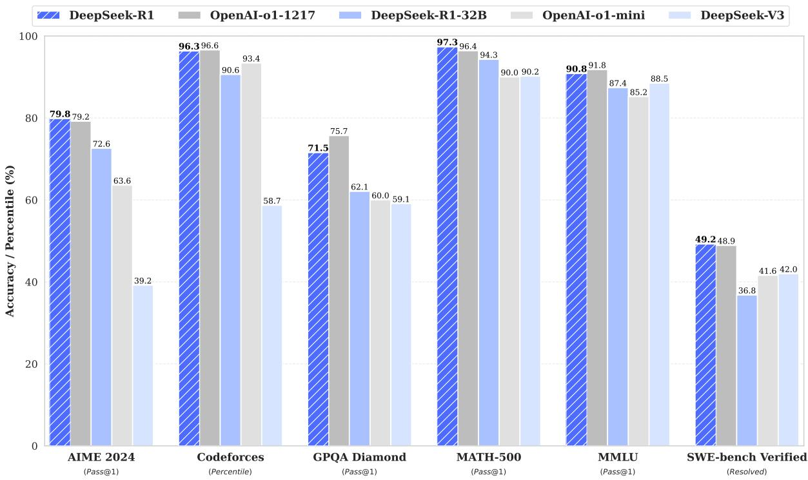

# Detailed Breakdown

## The Problem

Large language models face significant limitations in complex reasoning tasks despite their advances in general language understanding. Traditional approaches to improving reasoning capabilities rely heavily on massive supervised fine-tuning (SFT) datasets, which are expensive and time-consuming to create. Previous methods have struggled to achieve performance comparable to OpenAI's o1 series models, which pioneered inference-time scaling through extended Chain-of-Thought reasoning. The core challenges include: models cannot spontaneously develop reasoning behaviors without explicit supervision, existing reinforcement learning approaches depend on supervised data as starting points, and smaller models cannot effectively replicate the reasoning patterns discovered by larger models. These limitations create a bottleneck in developing accessible, high-performance reasoning AI systems.

## The Innovation

DeepSeek-R1 introduces a fundamental paradigm shift in reasoning model development through pure reinforcement learning without supervised fine-tuning as a preliminary step. The core technical insights include:

- **Autonomous Reasoning Emergence**: Models can spontaneously develop sophisticated reasoning behaviors including self-verification, reflection, and extended thinking time through RL alone, without any human-provided reasoning examples
- **Group Relative Policy Optimization (GRPO)**: A novel RL algorithm that eliminates the need for a critic model by estimating baselines from group scores, significantly reducing computational costs
- **Two-Stage Training Pipeline**: DeepSeek-R1-Zero demonstrates pure RL capabilities, while DeepSeek-R1 incorporates minimal cold-start data for readability improvements while maintaining autonomous reasoning development

This approach fundamentally differs from existing methods by removing dependency on supervised data, allowing models to discover reasoning patterns through self-evolution rather than imitation learning. The breakthrough demonstrates that reasoning capabilities are an emergent property that can be incentivized through appropriate reward structures rather than explicitly taught.

## How It Works

### 1. Base Model Selection and Template Design
The system starts with DeepSeek-V3-Base as the foundation model and implements a straightforward template requiring responses to include reasoning processes enclosed between special tags `<think>` and `</think>`, followed by final answers within `<answer>` tags. This minimal structural constraint ensures the model's natural progression during RL can be accurately observed without content-specific biases.

### 2. Pure Reinforcement Learning (DeepSeek-R1-Zero)
Using GRPO algorithm, the system samples multiple outputs for each question and optimizes the policy by maximizing rewards relative to group baselines. The reward system consists of two components:
- **Accuracy Rewards**: Rule-based verification for deterministic problems (math problems, coding challenges)
- **Format Rewards**: Ensures compliance with the specified template structure

The mathematical objective function maximizes the advantage computed from group rewards, avoiding the computational overhead of traditional actor-critic methods.

### 3. Multi-Stage Enhancement (DeepSeek-R1)
To address readability and language mixing issues in DeepSeek-R1-Zero, the enhanced pipeline incorporates:
- **Cold Start Data**: Thousands of long CoT examples with human-readable patterns and summaries
- **Reasoning-Oriented RL**: Large-scale RL training with language consistency rewards
- **Rejection Sampling**: Collection of 600k reasoning samples from RL checkpoints
- **Multi-Scenario RL**: Additional training incorporating helpfulness and harmlessness rewards

### 4. Knowledge Distillation
The reasoning patterns discovered by DeepSeek-R1 are transferred to smaller dense models (1.5B to 70B parameters) through supervised fine-tuning on 800k curated samples. This approach proves more effective than applying RL directly to smaller models, demonstrating that reasoning patterns from larger models provide better learning signals than autonomous discovery.

## Key Results

The evaluation demonstrates exceptional performance across reasoning, knowledge, and general tasks:

- **Mathematics**: **79.8% Pass@1 on AIME 2024**, slightly surpassing OpenAI-o1-1217; **97.3% on MATH-500**, performing on par with OpenAI-o1-1217
- **Coding**: **2,029 Elo rating on Codeforces**, outperforming 96.3% of human participants; **65.9% on LiveCodeBench**
- **Knowledge**: **90.8% on MMLU**, **84.0% on MMLU-Pro**, **71.5% on GPQA Diamond**, significantly outperforming DeepSeek-V3
- **General Capabilities**: **87.6% win-rate on AlpacaEval 2.0**, **92.3% on ArenaHard**, demonstrating strong performance on creative writing and open-domain tasks
- **Distilled Models**: DeepSeek-R1-Distill-Qwen-7B achieves **55.5% on AIME 2024**, surpassing QwQ-32B-Preview; DeepSeek-R1-Distill-Qwen-32B scores **72.6% on AIME 2024** and **94.3% on MATH-500**

The training process revealed fascinating emergent behaviors, including an "aha moment" where the model spontaneously learned to allocate more thinking time by reevaluating initial approaches. The self-evolution process showed consistent improvement in thinking time, with the model naturally learning to generate hundreds to thousands of reasoning tokens for complex problems.

## Practical Applications

### Mathematical Problem Solving
The model's exceptional performance on mathematical benchmarks (97.3% on MATH-500) enables applications in educational tutoring, mathematical research assistance, and automated problem-solving for engineering and scientific calculations.

### Software Development and Coding
With a 2,029 Codeforces Elo rating and strong performance on LiveCodeBench, the technology can power advanced code generation tools, debugging assistants, and automated programming tutors that can solve complex algorithmic challenges.

### Scientific Research and Analysis
The model's reasoning capabilities extend to scientific domains, making it suitable for research assistance, hypothesis generation, and complex data analysis tasks requiring logical deduction and multi-step reasoning.

### Educational Technology
The ability to generate detailed, step-by-step reasoning processes makes the technology ideal for educational applications, providing students with detailed explanations of problem-solving approaches across STEM subjects.

### Business Intelligence and Decision Support
The reasoning capabilities can be applied to complex business analysis, strategic planning, and decision support systems that require logical analysis of multiple factors and potential outcomes.

## Limitations & Considerations

- **Language Mixing**: DeepSeek-R1 may mix languages when handling queries in languages other than Chinese and English, potentially using English for reasoning regardless of the input language
- **Prompt Sensitivity**: The model shows sensitivity to prompting strategies, with few-shot prompting consistently degrading performance; zero-shot setting is recommended for optimal results
- **Limited General Capabilities**: Performance falls short of DeepSeek-V3 in tasks such as function calling, multi-turn conversations, complex role-playing, and JSON output formatting
- **Software Engineering**: Due to long evaluation times impacting RL efficiency, the model has not demonstrated significant improvements over DeepSeek-V3 on software engineering benchmarks
- **Resource Requirements**: Large-scale RL training requires substantial computational resources, though the distillation approach provides more accessible alternatives for smaller models

## What This Means for Builders

### Immediate Opportunities
Developers can immediately leverage the open-source DeepSeek-R1 models and distilled variants to build reasoning-capable applications without dependency on proprietary APIs. The availability of models across different parameter scales (1.5B to 70B) enables deployment across various hardware constraints and use cases.

### Implementation Pathway
Implementation can proceed through several approaches: direct API integration with hosted DeepSeek-R1 models, local deployment of distilled models for privacy-sensitive applications, or fine-tuning the distilled models on domain-specific data to further enhance performance in specialized domains. The comprehensive open-source release includes both the models and the training datasets.

### Strategic Implications
This research suggests a fundamental shift toward autonomous AI capability development rather than supervised learning approaches. The success of pure RL indicates that future AI development may focus more on creating appropriate reward structures and learning environments rather than curating massive supervised datasets. The distillation success demonstrates a new paradigm where large models discover reasoning patterns that can be efficiently transferred to smaller models.

### Cost Optimization
The GRPO algorithm significantly reduces RL training costs by eliminating the need for critic models, while the distillation approach provides an economical pathway to deploy reasoning capabilities across different model sizes. The cost-benefit analysis favors distillation over direct RL training for smaller models, with distilled models achieving better performance at lower computational cost than autonomously trained smaller models.