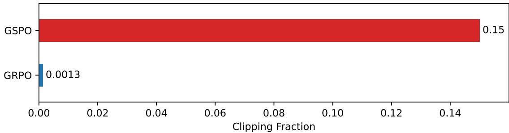

# Detailed Breakdown

## The Problem

Current reinforcement learning algorithms for training large language models face severe stability challenges that prevent scalable improvement. The state-of-the-art GRPO algorithm exhibits catastrophic model collapse when training massive models like Qwen3-30B-A3B-Base, particularly on tasks requiring long responses and complex reasoning. This instability stems from a fundamental misapplication of importance sampling weights at the token level, introducing high-variance training noise that accumulates over response length and is amplified by clipping mechanisms. Once collapse occurs, training becomes irreversible even with checkpoint restoration and hyperparameter tuning. Additionally, Mixture-of-Experts (MoE) models introduce unique stability challenges where expert activation volatility prevents normal convergence, requiring complex workarounds like Routing Replay that incur additional overhead and limit model capacity.

## The Innovation

GSPO introduces a paradigm shift from token-level to sequence-level policy optimization, fundamentally addressing the root causes of training instability. The core innovation aligns the unit of optimization with the unit of reward—both operating on complete responses rather than individual tokens. This approach eliminates the problematic token-level importance weights that introduce high-variance noise, replacing them with theoretically grounded sequence-level importance ratios based on sequence likelihood.

Key technical insights include:
- **Sequence-level importance ratios**: Using πθ(yi|x)/πθold(yi|x) instead of token-level ratios, aligning with importance sampling principles
- **Unified optimization units**: Matching reward and optimization units at the sequence level eliminates gradient noise
- **Length normalization**: Controlling variance and maintaining consistent numerical ranges across different response lengths
- **Group-based advantage estimation**: Computing normalized rewards as advantages of multiple responses to ensure alignment between rewarding and optimization

## How It Works

GSPO operates through a fundamentally different optimization framework that treats entire responses as cohesive units:

1. **Sequence-Level Ratio Computation**: GSPO computes importance ratios based on complete sequence likelihood using the formula si(θ) = (πθ(yi|x)/πθold(yi|x))^(1/|yi|), where the exponent normalizes by sequence length to control variance.

2. **Group-Based Advantage Estimation**: For each query x with G generated responses, advantages are computed as Ai = ri - (1/G)∑rj, providing relative performance measures within response groups.

3. **Sequence-Level Clipping**: Instead of clipping individual tokens, GSPO applies clipping to entire responses using the objective clip(si(θ)·Ai, (1-ε)·Ai, (1+ε)·Ai), where ε represents the clipping range.

4. **Gradient Calculation**: The gradient formulation ensures all tokens within a response receive equal weighting: ∇θL = ∑i Ai·∇θ log πθ(yi|x) for unclipped samples, eliminating the instability factor of varying token weights.

5. **GSPO-Token Variant**: For scenarios requiring finer-grained control, GSPO-token allows token-wise advantage customization while maintaining numerical equivalence to the base GSPO approach.

## Key Results

The empirical evaluation demonstrates GSPO's superior performance across multiple dimensions:

- **Training Stability**: GSPO maintains stable training throughout 30B parameter model training without catastrophic collapse, unlike GRPO which requires careful hyperparameter tuning
- **Superior Training Efficiency**: GSPO achieves **2x better training efficiency** than GRPO, delivering higher accuracy under the same computational budget
- **Continuous Performance Improvement**: Models show **steady performance gains** on AIME'24 (mathematics), LiveCodeBench (programming), and CodeForces benchmarks through increased training compute
- **MoE Training Revolution**: GSPO **eliminates the need for Routing Replay** strategies in MoE models, reducing overhead by ~10% while maintaining full model capacity utilization
- **Clipping Efficiency**: Despite clipping **100x more tokens** than GRPO, GSPO achieves superior training efficiency, indicating GRPO's token-level gradients are inherently noisy

## Practical Applications

### Advanced Mathematical Reasoning
GSPO enables stable training of models capable of solving competition-level mathematics problems (AIME'24), with continuous improvement achievable through extended training and increased generation lengths.

### Complex Programming Challenge Solving
The algorithm's stability allows models to tackle sophisticated programming tasks, demonstrated through superior performance on LiveCodeBench and CodeForces benchmarks with regular query set updates.

### Large-Scale MoE Model Training
GSPO fundamentally resolves expert-activation volatility in MoE models, enabling efficient training of sparse architectures without artificial routing constraints or additional memory overhead.

### Multi-Turn Dialogue Systems
The GSPO-token variant provides fine-grained control for conversational AI applications requiring token-level advantage adjustment across multiple dialogue turns.

### Training-Inference Disaggregation
GSPO's sequence-level approach tolerates precision discrepancies between training and inference engines, enabling partial rollout and multi-turn RL scenarios with reduced recomputation overhead.

## Limitations & Considerations

- **Clipping Range Sensitivity**: GSPO requires careful tuning of clipping ranges (3e-4 to 4e-4 vs. GRPO's 0.2 to 0.27) due to different importance ratio definitions
- **Sequence Length Dependency**: Length normalization is essential to prevent dramatic fluctuations in importance ratios across different response lengths
- **Computational Overhead**: While more efficient than GRPO, GSPO still requires significant computational resources for large-scale model training
- **Implementation Complexity**: The paradigm shift from token-level to sequence-level optimization requires substantial changes to existing RL training infrastructure
- **Benchmark Dependency**: Performance improvements demonstrated primarily on mathematical and programming tasks; generalization to other domains requires further validation

## What This Means for Builders

### Immediate Opportunities
GSPO provides the stable foundation needed for scaling reinforcement learning training without fear of catastrophic failure. Organizations can now confidently invest in large-scale RL training projects, knowing that the fundamental stability issues have been resolved. The algorithm's compatibility with existing infrastructure while eliminating complex stabilization strategies lowers the barrier to entry for advanced AI model development.

### Implementation Pathway
GSPO can be integrated into existing RL training pipelines with relatively modest modifications to the objective function and gradient computation components. The paper demonstrates successful implementation in the Qwen3 training framework, with code and methodology details available through the research team. Organizations can adopt GSPO incrementally, starting with pilot projects before scaling to full production deployments.

### Strategic Implications
GSPO represents a fundamental shift in how large language models are trained through reinforcement learning, potentially accelerating the development of increasingly capable AI systems. The algorithm's success in enabling stable MoE training suggests new architectural possibilities for sparse models, while its infrastructure simplification benefits may reduce the total cost of ownership for large-scale AI training operations.

### Cost Optimization
By eliminating the need for complex stabilization strategies like Routing Replay and reducing wasted computational resources from failed training runs, GSPO offers significant cost benefits. The superior training efficiency (2x improvement) means organizations can achieve the same model capabilities with approximately half the computational investment, or achieve superior performance within existing budgets. This economic advantage compounds with the ability to scale training reliably without catastrophic failures requiring complete restarts.