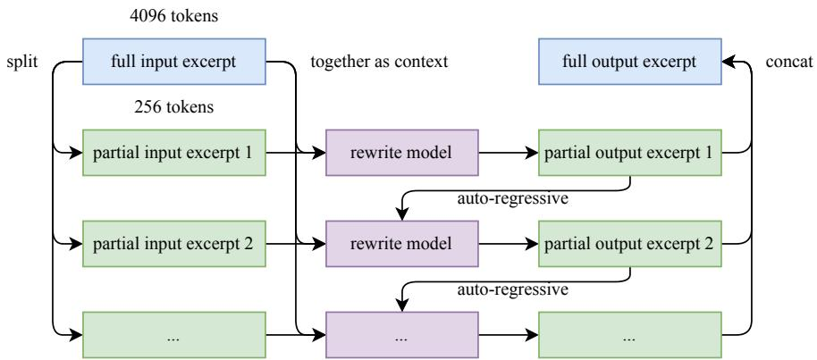

# Detailed Breakdown

## The Problem

Training large language models for agentic intelligence faces several critical challenges. First, as high-quality human data becomes increasingly limited, **token efficiency**—the learning signal per token—emerges as a crucial scaling coefficient. Models must extract maximum value from each training token while avoiding overfitting through repetition. Second, training instability becomes more severe at scale, particularly with efficient optimizers like Muon, which can experience **exploding attention logits** leading to loss spikes and training divergence. Third, agentic capabilities such as multi-step reasoning, long-term planning, and tool use are extremely rare in natural data, making it difficult to scale these capabilities through traditional supervised learning approaches. Finally, there's a fundamental trade-off between model performance and inference efficiency, especially for long-context processing essential in agentic applications.

## The Innovation

Kimi K2 introduces several breakthrough innovations that address these core challenges:

- **MuonClip Optimizer**: Combines the token-efficient Muon algorithm with a novel QK-Clip mechanism that constrains attention logits by rescaling query and key projection weights post-update. This enables stable training at massive scale while preserving Muon's efficiency advantages.

- **Synthetic Data Rephrasing Pipeline**: Implements domain-specific rephrasing strategies for Knowledge and Mathematics domains, using style-and perspective-diverse prompting combined with chunk-wise autoregressive generation to increase token utility without overfitting.

- **Ultra-Sparse MoE Architecture**: Uses 384 experts with only 8 activated per token (sparsity of 48), based on empirical scaling law analysis showing that increased sparsity consistently improves performance under fixed FLOPs.

- **Large-Scale Agentic Data Synthesis**: Creates diverse tools, agents, tasks, and trajectories through simulated and real-world environments, generating high-fidelity, verifiably correct agentic interactions at scale.

- **Joint Reinforcement Learning Framework**: Combines verifiable rewards (RLVR) with self-critique rubric mechanisms, enabling the model to learn from both externally defined tasks and evaluation of its own outputs.

Unlike existing approaches that rely heavily on human demonstrations or struggle with training stability at scale, Kimi K2's innovations enable efficient pre-training on massive datasets while maintaining stability and achieving superior agentic capabilities.

## How It Works

Kimi K2 operates through a sophisticated multi-stage training and architecture design:

1. **MuonClip Optimization**: The QK-Clip mechanism works by calculating the maximum attention logit per head during forward pass and applying selective weight clipping when values exceed threshold T=100. For regular multi-head attention, both queries and keys are scaled equally, while for Multi-head Latent Attention (MLA), clipping is applied only to unshared components: q and k' components are scaled by √Yₕ, qR (head-specific rotary) by Yₕ, and kR (shared rotary) is left untouched to avoid cross-head effects.

2. **Synthetic Data Generation**: The rephrasing pipeline employs three key components: (a) style-and perspective-diverse prompting using engineered prompts to generate faithful rephrasings, (b) chunk-wise autoregressive generation that divides texts into segments and rephrases them individually to preserve coherence, and (c) fidelity verification that compares semantic alignment between original and rewritten content.

3. **Ultra-Sparse MoE Architecture**: With 384 total experts and 8 activated per token, Kimi K2 achieves a sparsity ratio of 48. The model uses Multi-head Latent Attention (MLA) with 64 attention heads and a hidden dimension of 7168. Expert hidden dimension is 2048, and the model uses only 1 dense layer compared to 3 in DeepSeek-V3, reducing computational overhead.

4. **Multi-Stage Post-Training**: The post-training process includes supervised fine-tuning on diverse instruction datasets, large-scale agentic data synthesis for tool use learning, and joint reinforcement learning that combines verifiable rewards with self-critique mechanisms.

## Key Results

Kimi K2 demonstrates exceptional performance across diverse benchmarks, particularly excelling in agentic and coding tasks:

- **Tau2-Bench**: 66.1 (retail: 70.6, airline: 56.5, telecom: 65.8)
- **ACEBench**: 76.5 accuracy, outperforming most proprietary models
- **SWE-Bench Verified**: 65.8 in agentic mode, 51.8 in agentless mode
- **SWE-Bench Multilingual**: 47.3, showing strong multilingual coding capabilities
- **LiveCodeBench v6**: 53.7 pass@1, surpassing Claude Sonnet 4 (48.5) and GPT-4.1 (44.7)
- **OJBench**: 27.1 pass@1, significantly ahead of proprietary baselines
- **AIME 2025**: 49.5 avg@64, demonstrating strong mathematical reasoning
- **GPQA-Diamond**: 75.1 avg@8, showing exceptional scientific reasoning
- **MATH-500**: 97.4 accuracy, near-perfect mathematical performance
- **SimpleQA**: 31.0 correct, strong factual accuracy
- **Arena Hard v2.0**: 85.0 win rate, competitive with top proprietary models

The model was trained on 15.5 trillion tokens using MuonClip with zero loss spikes throughout the entire training process, demonstrating unprecedented training stability at trillion-parameter scale.

## Practical Applications

### Software Development & Code Generation
Kimi K2's exceptional performance on SWE-Bench (65.8) and LiveCodeBench (53.7) makes it ideal for autonomous software engineering tasks, including bug fixing, feature implementation, and code review. The model can handle complex, multi-step coding projects with minimal human intervention.

### Autonomous Tool Use & Agent Systems
With 76.5 accuracy on ACEBench and 66.1 on Tau2-Bench, K2 excels at learning to use unfamiliar tools and interacting with external environments. This enables sophisticated AI agents for customer service automation, data analysis workflows, and business process automation.

### Mathematical & Scientific Reasoning
The model's strong performance on AIME (49.5), MATH-500 (97.4), and GPQA-Diamond (75.1) makes it suitable for advanced problem-solving in mathematics, engineering, and scientific research applications.

### Multilingual Applications
K2's 47.3 score on SWE-Bench Multilingual demonstrates robust multilingual capabilities, enabling development of cross-lingual applications and global deployment.

### Long-Context Processing
The efficient architecture with 64 attention heads (vs 128 in comparable models) provides better long-context efficiency, making it suitable for document analysis, codebase understanding, and complex reasoning over extended contexts.

## Limitations & Considerations

- **Training Complexity**: The ultra-sparse MoE architecture with 384 experts introduces significant infrastructure complexity, requiring sophisticated parallelization strategies and memory management techniques.

- **Synthetic Data Quality**: While rephrasing improves token utility, ensuring factual accuracy and minimizing hallucinations in synthetic data remains challenging, requiring robust verification mechanisms.

- **Inference Cost**: Despite optimizations, the 1-trillion parameter model still requires substantial computational resources for inference, potentially limiting deployment in resource-constrained environments.

- **Long-Context Trade-offs**: The reduction to 64 attention heads improves efficiency but may result in modest performance degradation (0.5-1.2%) compared to architectures with more heads.

- **Tool Learning Scale**: While agentic data synthesis is effective, scaling this approach to cover the full breadth of real-world tools and environments remains an ongoing challenge.

- **Evaluation Bias**: Current benchmarks may not fully capture real-world agentic capabilities, and performance on controlled evaluations may not directly translate to production environments.

## What This Means for Builders

### Immediate Opportunities
Kimi K2's exceptional coding performance (65.8 on SWE-Bench Verified, 53.7 on LiveCodeBench) enables immediate development of autonomous software engineering tools, code review assistants, and debugging systems. The strong tool-use capabilities (76.5 on ACEBench) allow creation of sophisticated AI agents that can interact with APIs, databases, and external services without extensive custom training.

### Implementation Pathway
The model is open-source with both base and post-trained checkpoints available, allowing developers to fine-tune for specific domains. The efficient MuonClip optimizer enables cost-effective fine-tuning, and the model's architecture is designed to work well with standard tool-learning frameworks like ToolLLM and ACEBench.

### Strategic Implications
Kimi K2 represents a significant step toward democratizing advanced agentic AI capabilities that were previously only available through expensive proprietary models. This shift enables smaller organizations and researchers to build sophisticated AI agents and autonomous systems, potentially accelerating innovation in AI agent applications.

### Cost Optimization
The ultra-sparse MoE architecture with only 32.6 billion activated parameters provides favorable inference economics compared to dense models of similar capability. The high token efficiency from MuonClip optimization reduces training costs, while the model's strong performance means fewer API calls or retries are needed in production applications.