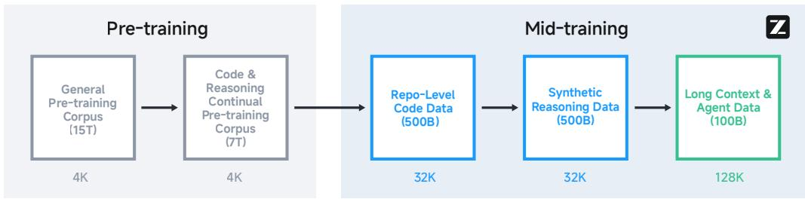

# Detailed Breakdown

## The Problem

The fundamental challenge in large language model development is the fragmentation of capabilities across different models and domains. While state-of-the-art proprietary models like OpenAI's o1/o3 and Anthropic's Claude Sonnet 4 demonstrate exceptional performance in specific domains, no single open-source model has achieved comprehensive mastery across the three critical capabilities needed for real-world problem-solving: Agentic abilities for interacting with external tools and environments, complex Reasoning for solving multi-step problems in mathematics and science, and advanced Coding skills for tackling real-world software engineering tasks.

This fragmentation creates significant practical limitations: developers must integrate multiple specialized models, increasing complexity and costs; companies face vendor lock-in with proprietary systems; and the research community lacks access to truly generalist open-source models that can serve as foundation for advanced AI systems. The parameter efficiency problem is particularly acute—existing models like DeepSeek-R1 (671B parameters) and Kimi K2 (1043B parameters) require massive computational resources while still not delivering unified performance across all three domains.

## The Innovation

GLM-4.5 introduces several fundamental technical breakthroughs that differentiate it from existing approaches:

- **Hybrid Reasoning Architecture**: Unlike models that are limited to either Chain-of-Thought reasoning or direct responses, GLM-4.5 supports both thinking mode for complex reasoning/agentic tasks and non-thinking mode for instant responses, allowing the model to adapt its cognitive approach based on task complexity.

- **Mixture-of-Experts Efficiency**: With 355B total parameters but only 32B activated parameters (and a compact 106B/12B version), GLM-4.5 achieves state-of-the-art performance while being highly parameter-efficient compared to competitors like DeepSeek-R1 (671B/37B) and Kimi K2 (1043B/32B).

- **Architectural Optimizations**: The model employs deeper networks (89 MoE layers vs typical 58-60), 2.5x more attention heads (96 heads for 5120 hidden dimension), QK-Norm for stable attention logits, and Multi-Token Prediction (MTP) layers for speculative decoding during inference.

- **Expert Model Iteration Training**: A novel two-stage post-training approach that first creates specialized expert models (Reasoning, Agent, General chat) then integrates them through self-distillation techniques, enabling unified capabilities while maintaining specialized performance.

The approach fundamentally differs from existing solutions by prioritizing depth over width in MoE architecture, implementing hybrid reasoning modes, and using expert iteration rather than end-to-end training for complex capabilities.

## How It Works

### 1. **Multi-Stage Training Pipeline**
GLM-4.5 undergoes a comprehensive training process across multiple stages:

- **Pre-training Stage 1**: Training on 23T tokens from diverse sources (webpages, social media, books, papers, code repositories) with 4K sequence length, using the Muon optimizer with cosine decay schedule and quality-based data sampling strategies.

- **Pre-training Stage 2**: Focused training on up-sampled source code, mathematics, and science content to build domain-specific foundations.

- **Mid-Training Stages**: Three specialized phases including repo-level code training (32K context), synthetic reasoning data training, and long-context & agent training (extended to 128K context) with best-fit packing to preserve reasoning processes.

### 2. **Expert Model Iteration Framework**
The post-training process revolutionizes capability development through:

- **Stage 1 - Expert Training**: Creation of three specialized expert models (Reasoning, Agent, General chat) using domain-specific supervised fine-tuning and reinforcement learning.

- **Stage 2 - Unified Training**: Integration of expert capabilities through self-distillation, enabling the base model to generate responses through both deliberative reasoning and direct response modes while balancing long CoT reasoning with immediate response data.

### 3. **Advanced Reinforcement Learning Techniques**
The system employs sophisticated RL strategies:

- **Reasoning RL**: Two-stage difficulty-based curriculum learning, single-stage RL at 64K output length, dynamic sampling temperature adjustment, and specialized approaches for code (token-weighted mean loss) and science (expert-verified questions) domains.

- **Agentic RL**: Outcome supervision with process action format penalties, iterative self-distillation, and test-time compute scaling through interaction turns for web search and software engineering tasks.

- **General RL**: Multi-source feedback system combining rule-based feedback, human feedback (RLHF), and model-based feedback (RLAIF) with specialized components for instruction following, function calling, and pathology correction.

### 4. **Specialized Infrastructure**
The Slime RL framework provides:

- **Flexible Hybrid Training**: Support for both synchronous (co-located) and asynchronous (disaggregated) training modes optimized for different RL task types.

- **Accelerated Rollout**: BF16 training with FP8 inference for efficient data generation, plus dynamic online block-wise FP8 quantization.

- **Agent-Oriented Design**: High-concurrency Docker runtime, fully asynchronous training loop, and unified HTTP endpoint interface for diverse agent frameworks.

## Key Results

GLM-4.5 demonstrates exceptional performance across comprehensive evaluation:

- **Agentic Performance**: Achieves **70.1% on TAU-Bench** (retail: 79.7%, airline: 60.4%) and **77.8% on BFCL v3**, outperforming Claude Sonnet 4 and Gemini 2.5 Pro. For web browsing, scores **26.4% on BrowseComp**, significantly outperforming Claude Opus 4 (18.8%).

- **Reasoning Excellence**: Outstanding results including **91.0% on AIME 24**, **79.1% on GPQA**, **72.9% on LiveCodeBench (2407-2501)**, and **14.4% on HLE (Humanity's Last Exam)**, outperforming Claude Opus 4 on multiple benchmarks.

- **Coding Capability**: Scores **64.2% on SWE-bench Verified** and **37.5% on Terminal-Bench**, outperforming GPT-4.1 and Gemini-2.5-pro, competitive with Claude Sonnet 4 despite having significantly fewer parameters.

- **Parameter Efficiency**: With only 355B total parameters (vs DeepSeek-R1's 671B and Kimi K2's 1043B), GLM-4.5 achieves **3rd place overall** among all evaluated models and **2nd place on agentic benchmarks**.

## Practical Applications

### Autonomous Customer Service Agents
GLM-4.5's strong performance on TAU-Bench (70.1%) enables sophisticated customer service agents that can handle complex multi-step interactions across retail and airline domains, accessing external tools and databases to resolve customer issues autonomously.

### Scientific Computing and Research
With 91.0% on AIME 24 and 41.7% on SciCode, the model excels at mathematical problem-solving and scientific coding tasks, making it ideal for research automation, computational science, and educational applications requiring deep reasoning capabilities.

### Software Development Automation
The 64.2% score on SWE-bench Verified demonstrates strong real-world coding capabilities, enabling automated bug fixing, feature implementation, and code maintenance tasks through intelligent software engineering agents.

### Web Research and Information Synthesis
GLM-4.5's 26.4% performance on BrowseComp enables advanced web browsing agents that can conduct multi-step research across multiple sources, synthesize information, and provide comprehensive answers to complex queries.

### Multilingual Translation and Communication
Evaluation on challenging translation tasks shows GLM-4.5 significantly outperforms specialized translation models (average score 1.71 vs 0.65 for Seed-X), handling cultural context, internet slang, and domain-specific terminology effectively.

## Limitations & Considerations

- **Computational Requirements**: While more parameter-efficient than competitors, the 355B parameter model still requires substantial computational resources for training and inference, potentially limiting accessibility for smaller organizations.

- **Web Search Performance Gap**: Despite strong overall agentic performance, GLM-4.5 (26.4% on BrowseComp) significantly trails OpenAI o3 (49.7%), indicating room for improvement in web browsing capabilities.

- **Bias and Fairness Challenges**: SafetyBench evaluation reveals lower performance in Unfairness and Bias (77.4%) compared to other safety categories, indicating ongoing challenges in addressing fairness issues.

- **Translation Quality Variance**: While outperforming specialized models overall, translation performance may vary across language pairs and domain-specific terminology, requiring careful validation for critical applications.

- **Context Length Trade-offs**: The 128K context window enables long-document processing but may incur increased computational costs and latency for applications requiring shorter contexts.

## What This Means for Builders

### Immediate Opportunities
Developers can now build comprehensive AI applications using a single model that excels across reasoning, coding, and agentic tasks, eliminating the need to integrate multiple specialized models. The availability of both GLM-4.5 (355B) and GLM-4.5-Air (106B) versions allows teams to choose the appropriate balance of capability and resource requirements for their specific use case.

### Implementation Pathway
The models are available through multiple channels including Z.ai, BigModel.cn, and as open-source on Hugging Face, providing flexible deployment options. The open-source evaluation toolkit at https://github.com/zai-org/glm-simple-evals ensures reproducible benchmarking and validation. Organizations can leverage the hybrid reasoning modes to optimize for different use cases—thinking mode for complex problem-solving and direct response mode for real-time interactions.

### Strategic Implications
GLM-4.5's competitive performance against proprietary models while remaining open-source represents a significant shift in the AI landscape, reducing vendor lock-in and enabling more transparent, customizable AI systems. The parameter efficiency breakthrough suggests a new direction in model architecture that prioritizes depth and specialized training over brute-force parameter scaling.

### Cost Optimization
The MoE architecture with only 32B activated parameters (vs 355B total) enables significant cost savings during inference compared to dense models of similar capability. The hybrid reasoning approach allows further optimization by using direct response mode for simpler tasks, reducing computational costs while maintaining response quality. The availability of a smaller 106B/12B version (GLM-4.5-Air) provides additional cost flexibility for applications with tighter resource constraints.