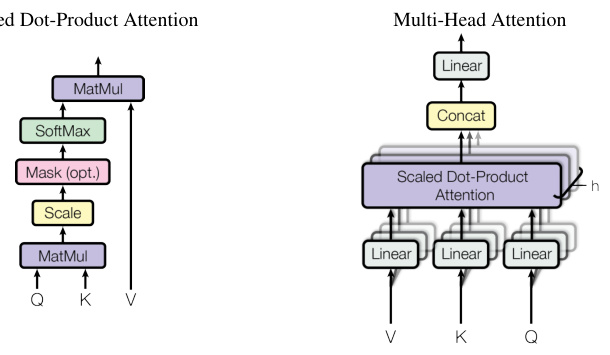

# Detailed Breakdown

## The Problem

Recurrent neural networks (RNNs), long short-term memory (LSTM) networks, and gated recurrent units (GRUs) were the dominant approaches for sequence modeling tasks like machine translation and language processing. However, these models suffered from fundamental computational limitations:

1. **Sequential Processing Bottleneck**: RNNs process tokens one at a time, preventing parallelization within training examples. This becomes critical at longer sequence lengths due to memory constraints limiting batching across examples.

2. **Long-Range Dependency Challenge**: Learning relationships between distant positions in sequences requires gradients to flow through many time steps, making it difficult to capture long-range dependencies effectively.

3. **Computational Inefficiency**: The sequential nature of RNNs results in O(n) sequential operations, where n is sequence length, making training slow and resource-intensive.

Despite optimizations like factorization tricks and conditional computation, the fundamental constraint of sequential computation remained a major bottleneck limiting model performance and training efficiency.

## The Innovation

The Transformer introduces a paradigm shift by completely eliminating recurrence and convolution, relying exclusively on attention mechanisms to process sequences. This represents three fundamental breakthroughs:

**Key Technical Insights**:
- **Self-Attention**: Each position in a sequence can directly attend to all other positions, capturing dependencies regardless of distance in O(1) operations
- **Multi-Head Attention**: Parallel attention layers allow the model to jointly attend to information from different representation subspaces simultaneously
- **Positional Encoding**: Since the model contains no recurrence or convolution, sinusoidal encodings inject information about token positions

Unlike previous approaches that combined attention with recurrent networks, the Transformer is the first transduction model relying entirely on self-attention to compute input and output representations without sequence-aligned RNNs or convolutions. This architectural choice enables:
- Constant O(1) path length between any two positions (vs O(n) for RNNs)
- Full parallelization across all sequence positions
- Superior performance on long-range dependencies

## How It Works

The Transformer follows an encoder-decoder architecture using stacked self-attention and point-wise feed-forward layers:

### 1. **Encoder-Decoder Structure**
The encoder maps an input sequence (x₁,...,xₙ) to continuous representations z=(z₁,...,zₙ). The decoder then generates output sequence (y₁,...,yₘ) auto-regressively, consuming previously generated symbols as additional input.

### 2. **Encoder Stack (N=6 layers)**
Each encoder layer contains two sub-layers:
- **Multi-Head Self-Attention**: Allows each position to attend to all positions in the previous layer
- **Position-wise Feed-Forward Network**: Two linear transformations with ReLU activation, applied identically to each position

Both sub-layers employ residual connections followed by layer normalization: LayerNorm(x + Sublayer(x))

### 3. **Decoder Stack (N=6 layers)**
Each decoder layer contains three sub-layers:
- **Masked Multi-Head Self-Attention**: Prevents positions from attending to subsequent positions
- **Encoder-Decoder Attention**: Queries from previous decoder layer attend to encoder outputs
- **Position-wise Feed-Forward Network**: Identical to encoder feed-forward layers

### 4. **Scaled Dot-Product Attention**

The core attention function computes weighted sums of values:
Attention(Q,K,V) = softmax(QKᵀ/√dₖ)V

Where Q, K, V are matrices of queries, keys, and values, and dₖ is key dimension. The scaling factor prevents dot products from growing large, which would push softmax into regions with extremely small gradients.

### 5. **Multi-Head Attention**
Instead of single attention with d_model-dimensional keys/values/queries, projections are performed h=8 times with different learned linear projections to dₖ, dₖ, and dᵥ dimensions (64 each). Attention functions run in parallel, outputs are concatenated and projected again.

### 6. **Positional Encoding**
Sinusoidal functions of different frequencies encode position information:
- PE_(pos,2i) = sin(pos/10000^(2i/d_model))
- PE_(pos,2i+1) = cos(pos/10000^(2i/d_model))

This choice allows the model to easily learn relative position relationships since PE_(pos+k) can be represented as a linear function of PE_pos.

## Key Results

The Transformer achieves unprecedented performance across multiple tasks:

**Machine Translation Performance**:
- **28.4 BLEU** on WMT 2014 English-to-German translation, improving over existing best results (including ensembles) by over 2 BLEU
- **41.8 BLEU** on WMT 2014 English-to-French translation, establishing new single-model state-of-the-art
- Training time of only **12 hours** on 8 P100 GPUs for base models, compared to days/weeks for competitive models
- **Training cost reduction**: 10x cheaper than previous state-of-the-art models (3.3 × 10¹⁸ FLOPs vs 1.0 × 10²⁰ FLOPs)

**English Constituency Parsing**:
- **91.3 F1** on WSJ (limited training data) - competitive with state-of-the-art
- **92.7 F1** in semi-supervised setting - beating all previous models except RNN Grammar
- Outperforms BerkeleyParser even when training only on 40K sentences

**Computational Efficiency**:
- O(n²·d) complexity per layer vs O(n·d²) for recurrent models
- **O(1) sequential operations** vs O(n) for RNNs
- **O(1) maximum path length** between any two positions vs O(n) for RNNs and O(logₖ(n)) for convolutions

## Practical Applications

### Machine Translation Systems
The Transformer's superior translation quality and training efficiency make it ideal for commercial translation services, real-time translation applications, and low-resource language translation where training cost is a critical factor.

### Content Generation and Summarization
The model's ability to capture long-range dependencies enables coherent long-form text generation, document summarization, and content creation applications requiring understanding of context across entire documents.

### Language Understanding and Analysis
Multi-head attention mechanisms provide interpretable attention patterns, making the Transformer valuable for syntactic parsing, semantic analysis, sentiment analysis, and other NLP tasks requiring deep language understanding.

### Question Answering and Dialogue Systems
The architecture's parallel processing and context handling capabilities enable sophisticated chatbots, virtual assistants, and question-answering systems that maintain context over long conversations.

### Cross-Modal Applications
The attention mechanism can be adapted for vision-language tasks, document processing, and other applications requiring understanding of relationships between different types of data.

## Limitations & Considerations

- **Quadratic Complexity**: Self-attention has O(n²) complexity in sequence length, making it computationally expensive for very long sequences
- **Memory Requirements**: Processing all attention weights simultaneously requires significant memory for long sequences
- **Fixed Context Window**: The model processes sequences of fixed maximum length, requiring chunking strategies for documents
- **Training Data Requirements**: Like all deep learning models, requires substantial training data for optimal performance
- **Hyperparameter Sensitivity**: Performance depends on careful tuning of learning rate schedules, dropout rates, and architectural parameters
- **Positional Encoding Limitations**: Fixed sinusoidal encodings may not optimally capture position patterns for all tasks

## What This Means for Builders

### Immediate Opportunities

Developers can immediately leverage the Transformer architecture for any sequence-to-sequence task, achieving state-of-the-art results with significantly reduced training costs. The architecture's parallel nature enables faster iteration cycles and experimentation with larger models.

### Implementation Pathway

The authors released their code as part of the TensorFlow tensor2tensor library, providing a complete implementation including training scripts, preprocessing tools, and evaluation pipelines. The modular architecture allows easy adaptation to different domains and tasks.

### Strategic Implications

The Transformer represents a fundamental shift in neural network architecture design, moving away from sequential processing toward attention-based parallel computation. This has sparked a new generation of attention-based models and research directions, establishing attention as the primary mechanism for sequence modeling.

### Cost Optimization

The dramatic reduction in training cost (up to 90% compared to previous state-of-the-art) makes advanced AI capabilities accessible to smaller organizations and research groups. The ability to train competitive models on modest hardware (8 GPUs for 12 hours) democratizes access to cutting-edge AI technology.