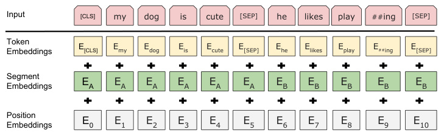

# Detailed Breakdown

## The Problem

Pre-training language representations has shown significant improvements for natural language processing tasks, but existing approaches were fundamentally limited by their unidirectional nature. Traditional language models like OpenAI GPT could only condition on left context (previous tokens), while feature-based approaches like ELMo used shallow concatenations of independently trained left-to-right and right-to-left models. These limitations were particularly problematic for tasks requiring understanding of both preceding and following context, such as question answering where answer tokens need context from both the question and surrounding passage. The unidirectional constraint restricted the choice of architectures during pre-training and was sub-optimal for sentence-level tasks and potentially harmful for token-level tasks requiring bidirectional understanding.

## The Innovation

BERT introduces two groundbreaking technical innovations that overcome the unidirectionality limitation:

- **Masked Language Model (MLM)**: Randomly masks 15% of input tokens and trains the model to predict the original vocabulary ID based only on context, enabling deep bidirectional representations
- **Next Sentence Prediction (NSP)**: Binary classification task that predicts whether sentence B follows sentence A in the original text, capturing sentence relationships crucial for QA and NLI tasks

The core insight is that bidirectional conditioning at every layer allows the model to fuse left and right context, creating truly contextualized word representations. Unlike ELMo's shallow concatenation of independently trained models, BERT's unified architecture enables deep bidirectional learning throughout all Transformer layers. This approach differs fundamentally from previous solutions by eliminating the unidirectional constraint entirely rather than working around it with architectural tricks.

## How It Works

BERT's architecture consists of two main phases: pre-training and fine-tuning, using the same underlying Transformer model.

1. **Model Architecture**: BERT uses multi-layer bidirectional Transformer encoders with two configurations:
   - BERTBASE: 12 layers, 768 hidden size, 12 attention heads, 110M parameters
   - BERTLARGE: 24 layers, 1024 hidden size, 16 attention heads, 340M parameters

2. **Input Representation**: Each input token embedding is the sum of three components:
   - Token embeddings using WordPiece tokenization (30,000 vocabulary)
   - Segment embeddings indicating sentence A or B membership
   - Position embeddings for sequence position
   - Special [CLS] token for classification tasks and [SEP] token for sentence separation

3. **Pre-training Tasks**:
   - **Masked LM**: 15% of tokens are randomly masked with 80% [MASK] token, 10% random token, 10% unchanged
   - **Next Sentence Prediction**: 50% actual next sentence (IsNext), 50% random sentence (NotNext)

4. **Fine-tuning**: Simple addition of task-specific output layers with all parameters fine-tuned end-to-end using the same pre-trained model across different tasks

## Key Results

BERT achieves state-of-the-art results across 11 NLP tasks with substantial improvements:

- **GLUE Benchmark**: 80.5% average score (7.7% absolute improvement), with MultiNLI accuracy of 86.7% (4.6% improvement)
- **SQuAD v1.1**: 93.2 F1 score (1.5 point absolute improvement), outperforming human-level performance
- **SQuAD v2.0**: 83.1 F1 score (5.1 point improvement) on the more realistic task with unanswerable questions
- **SWAG**: 86.3% accuracy (8.3% improvement over OpenAI GPT)
- **CoNLL-2003 NER**: 92.8 F1 score using fine-tuning approach

Evaluation was performed on diverse datasets including question answering (SQuAD), natural language inference (MNLI, QNLI), sentiment analysis (SST-2), linguistic acceptability (CoLA), paraphrase detection (MRPC, QQP), and commonsense reasoning (SWAG). The most surprising results were the large improvements on small datasets like MRPC (3.6k examples) and the consistent benefits of scaling to larger model sizes.

## Practical Applications

### Question Answering Systems
BERT's bidirectional understanding enables precise answer span prediction in reading comprehension tasks, allowing chatbots and search engines to accurately extract answers from passages based on natural language questions.

### Natural Language Inference
The next sentence prediction task provides strong foundation for understanding logical relationships between sentences, enabling applications like automated fact-checking, content moderation, and logical reasoning systems.

### Named Entity Recognition
BERT achieves state-of-the-art performance on entity recognition without task-specific architecture changes, making it ideal for document processing, information extraction, and content analysis systems.

### Sentiment Analysis
Deep contextual understanding allows more nuanced sentiment detection that considers surrounding context, improving accuracy for social media monitoring, customer feedback analysis, and market research.

### Text Classification
The unified architecture enables transfer learning across classification tasks with minimal adaptation, reducing development time for spam detection, content categorization, and document routing systems.

## Limitations & Considerations

- **Computational Cost**: Pre-training requires 4 days on 16 Cloud TPUs for BERTLARGE, making reproduction expensive
- **Memory Requirements**: 512 token sequence limit due to quadratic attention complexity, restricting long-document processing
- **Mask-fine-tune Mismatch**: The [MASK] token appears during pre-training but not fine-tuning, though the mixed masking strategy mitigates this
- **Training Data Dependence**: Performance heavily dependent on quality and quantity of pre-training data (3.3B words used)
- **Language Specificity**: Original models trained only on English, requiring separate pre-training for other languages

## What This Means for Builders

### Immediate Opportunities

Developers can immediately leverage BERT for production NLP applications without requiring task-specific architectures. The fine-tuning approach enables rapid development cycles - most tasks can be implemented in hours rather than weeks. Pre-trained models are publicly available, eliminating the need for expensive pre-training infrastructure. The consistent performance gains across diverse tasks make BERT suitable as a default starting point for any new NLP project.

### Implementation Pathway

Implementation involves selecting an appropriate model size (BASE vs LARGE), preparing data in BERT's input format with [CLS] and [SEP] tokens, and fine-tuning with small learning rates (2e-5 to 5e-5) for 2-4 epochs. The Hugging Face transformers library provides easy access to pre-trained models and fine-tuning utilities. Fine-tuning typically requires only a few hours on a single GPU, making it accessible to small teams and individual developers.

### Strategic Implications

BERT represents a paradigm shift from task-specific engineering to transfer learning approaches, suggesting future NLP systems will increasingly rely on large pre-trained models with minimal task-specific adaptation. The success of scaling to larger models indicates continued performance improvements with increased model size and training data. This trend favors organizations with access to computational resources and large datasets, potentially widening the gap between well-resourced companies and smaller competitors.

### Cost Optimization

While BERT reduces development costs through transfer learning, computational costs during inference remain significant, especially for BERTLARGE. Model distillation techniques and quantization can reduce inference costs for production deployment. The feature-based approach, while slightly less accurate than fine-tuning, allows pre-computation of representations for scenarios requiring many experiments with limited computational budgets. For most applications, the performance improvements justify the increased computational costs compared to previous approaches.