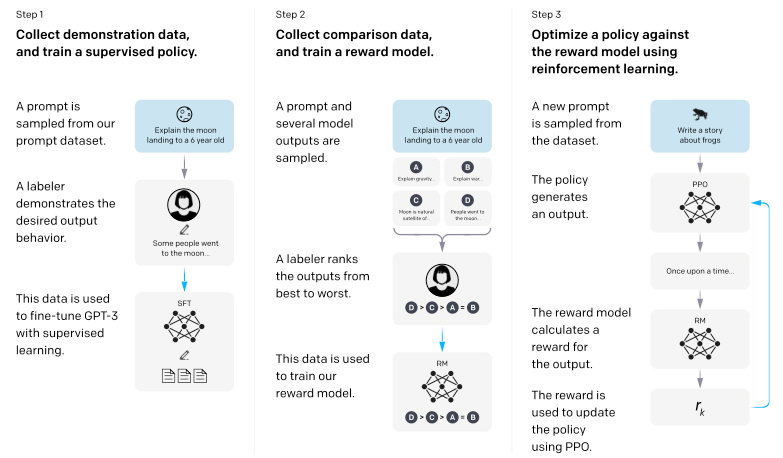
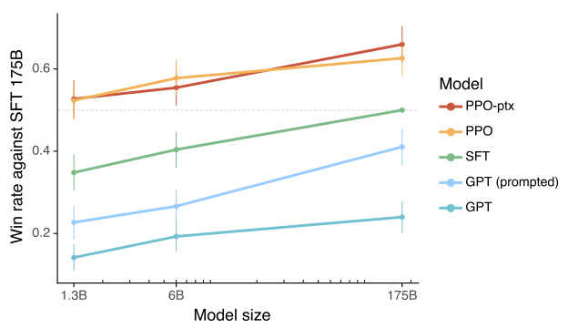

# Detailed Breakdown

## The Problem

Large language models (LLMs) face a fundamental misalignment between their training objective and user needs. Models like GPT-3 are trained to predict the next token on internet text, which differs significantly from the objective "follow the user's instructions helpfully and safely." This results in several critical issues:

- **Untruthful outputs**: Models generate fabricated information or "hallucinate" facts, especially on closed-domain tasks
- **Toxic content**: Models can produce biased, harmful, or inappropriate responses
- **Instruction failure**: Models often fail to follow explicit user instructions or constraints
- **Context mismatch**: Public NLP datasets don't reflect real-world usage patterns, where 57% of API use involves open-ended generation and brainstorming versus only 18% for classification and QA

The challenge is particularly acute for deployed models used in hundreds of applications where reliability and safety are paramount. Simply making models larger doesn't inherently solve these alignment problems.

## The Innovation

The core breakthrough is applying **reinforcement learning from human feedback (RLHF)** to align language models with user intentions across a broad distribution of tasks. This approach differs fundamentally from previous solutions in several ways:

- **Three-stage training process**: Combines supervised learning, reward modeling, and policy optimization
- **Real-world data**: Uses prompts from actual OpenAI API customers rather than synthetic academic datasets
- **Multi-objective alignment**: Simultaneously optimizes for helpfulness, honesty, and harmlessness
- **Cost-effective scaling**: Achieves better alignment with significantly less compute than training larger models

Key technical insights:
- Human preferences can serve as effective reward signals for language model fine-tuning
- Models can generalize "instruction following" to domains not explicitly trained on
- Performance regressions can be mitigated by mixing pretraining gradients during RLHF
- Small, focused human feedback datasets outperform large public NLP task compilations

](./images/7db024754ac44f81e47b09962966d8db.jpg)

## How It Works

The RLHF methodology consists of three distinct stages:

### 1. Supervised Fine-Tuning (SFT)
- **Data collection**: Human labelers write demonstrations of desired behavior on 13k training prompts
- **Training approach**: Fine-tune GPT-3 using supervised learning for 16 epochs with cosine learning rate decay
- **Dataset sources**: Mix of API customer prompts and labeler-written instructions covering diverse tasks

### 2. Reward Model (RM) Training
- **Comparison collection**: Labelers rank 4-9 model outputs per prompt, creating multiple pairwise comparisons
- **Model architecture**: 6B parameter model (smaller than base models for stability)
- **Efficient batching**: Process all K choose 2 comparisons from each prompt as single batch element
- **Loss function**: Cross-entropy loss on comparison pairs with reward model output representing log odds of preference

### 3. Reinforcement Learning Optimization
- **Algorithm**: Proximal Policy Optimization (PPO) with reward model as scalar reward function
- **KL penalty**: Per-token KL penalty from SFT model to prevent over-optimization
- **Pretraining mix**: PPO-ptx variant includes pretraining gradients to minimize performance regressions
- **Environment**: Bandit setup presenting random prompts with episode termination after response

The combined optimization objective for PPO-ptx:
$$\text{PPO objective} + \gamma E_{x \sim D_{\text{pretrain}}}[\log(\pi_{\phi}^{\text{RL}}(x))]$$

Where γ controls the strength of pretraining gradients.

## Key Results

The experimental results demonstrate substantial improvements across multiple dimensions:

- **Human preference rates**: 175B InstructGPT outputs preferred over GPT-3 **85±3%** of the time, **71±4%** over few-shot GPT-3
- **Parameter efficiency**: 1.3B InstructGPT outperforms 175B GPT-3 despite **100x fewer parameters**
- **Truthfulness improvements**: **2x increase** in truthful and informative answers on TruthfulQA benchmark
- **Hallucination reduction**: Closed-domain hallucination rate reduced from **41% to 21%**
- **Toxicity reduction**: **25% fewer** toxic outputs when prompted to be respectful
- **Generalization**: Models follow instructions in non-English languages and code tasks despite minimal training data

](./images/d499829f7d56a58aa7a0ea4694f1be1c.jpg)

The evaluation setup included:
- **API prompt distribution**: Prompts from OpenAI API customers (primarily English)
- **Public NLP benchmarks**: TruthfulQA, RealToxicityPrompts, Winogender, CrowS-Pairs
- **Human evaluators**: 40 trained contractors with 72.6±1.5% inter-annotator agreement
- **Model sizes**: 1.3B, 6B, and 175B parameter variants

## Practical Applications

### Customer Service and Support
InstructGPT models show significant improvements in appropriateness for customer assistant contexts, better following explicit constraints (like response length limits), and more reliably attempting the correct instruction task. This makes them ideal for chatbots, help desks, and support systems.

### Content Creation and Generation
The models excel at open-ended generation tasks (45.6% of API usage), brainstorming (11.2%), and creative writing while maintaining safety and truthfulness standards.

### Code Development and Documentation
Despite limited training data, InstructGPT demonstrates ability to summarize code, answer technical questions, and follow programming-related instructions, suggesting applications in development tools and technical documentation.

### Educational and Training Applications
Improved truthfulness and reduced hallucination rates make these models suitable for educational content, tutoring systems, and knowledge delivery where accuracy is critical.

### Multilingual Applications
The models show promising generalization to non-English instructions, enabling international applications even with English-focused training data.

## Limitations & Considerations

### Methodology Constraints
- **Labeler demographics**: Primarily English-speaking contractors from US/Southeast Asia, not representative of global user base
- **Single annotator labeling**: Most comparisons labeled by only 1 contractor for cost reasons
- **Context dependence**: Harmlessness assessment requires speculation about real-world deployment contexts

### Model Limitations
- **Remaining toxic outputs**: Models still generate biased or harmful content despite improvements
- **False premise handling**: Models sometimes incorrectly assume false premises are true
- **Over-hedging**: Tendency to provide multiple possible answers even when clear answers exist
- **Multi-constraint handling**: Performance degrades with multiple explicit constraints
- **Harmful instruction compliance**: Models generally follow user instructions even when potentially harmful

### Performance Trade-offs
- **Alignment tax**: Initial RLHF caused performance regressions on public NLP datasets
- **Computational costs**: Additional training required beyond base model pretraining
- **Generalization boundaries**: Limited understanding of how well instruction-following generalization scales

## What This Means for Builders

### Immediate Opportunities
The RLHF approach enables developers to create more reliable and controllable language model applications today. The method's effectiveness with smaller models suggests opportunities for cost-effective deployments where compute resources are limited. Companies can implement similar fine-tuning pipelines using their own user feedback and preference data.

### Implementation Pathway
Organizations can adopt this methodology by:
1. Collecting user prompts and demonstrations relevant to their use cases
2. Building internal labeling processes for preference data collection
3. Implementing three-stage training pipeline using existing open-source tools
4. Fine-tuning pre-trained models rather than training from scratch

The compute requirements are modest compared to pretraining (60 petaflops/s-days for 175B PPO-ptx vs 3,640 for GPT-3), making it accessible to more organizations.

### Strategic Implications
This research validates RLHF as a scalable alignment technique applicable to real-world AI systems. The low alignment tax suggests economic incentives favor adopting aligned models over unaligned but more capable ones. The approach provides a foundation for future work on aligning increasingly capable AI systems.

### Cost Optimization
The demonstrated parameter efficiency (1.3B outperforming 175B) suggests significant cost savings potential. Organizations should weigh the additional alignment training costs against savings from using smaller, more efficient models. The methodology's cost-effectiveness relative to training larger models makes it attractive for companies looking to deploy reliable AI without massive computational investments.