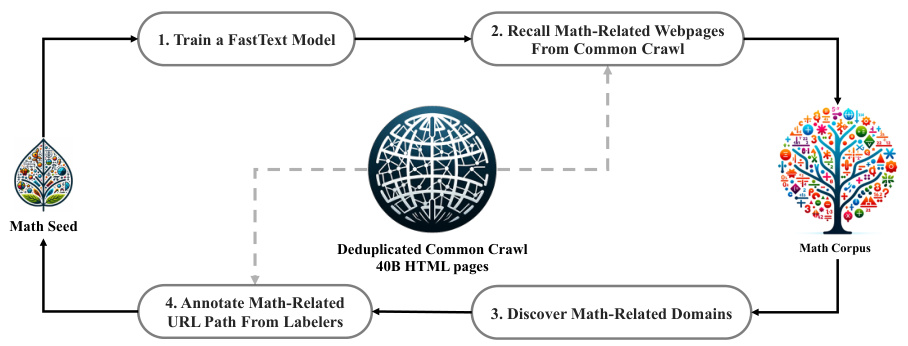
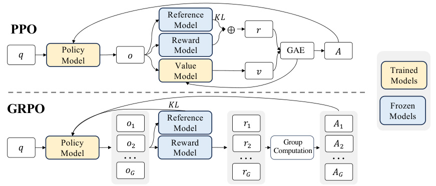

# Detailed Breakdown

## The Problem

Mathematical reasoning presents unique challenges for large language models due to its requirement for logical precision, multi-step reasoning, and symbolic manipulation. Existing open-source models significantly lag behind proprietary systems like GPT-4 and Gemini-Ultra on mathematical benchmarks. The gap is particularly pronounced on competition-level problems (MATH benchmark) where open models typically score below 35% while closed models achieve over 50%. This disparity limits scientific research, educational applications, and practical problem-solving capabilities that rely on advanced mathematical reasoning.

The core technical challenges include: the need for extensive high-quality mathematical training data, the inefficiency of traditional reinforcement learning approaches for mathematical tasks, and the difficulty of maintaining both mathematical and general reasoning capabilities. Previous attempts at mathematical domain-specific models have either required massive scale (hundreds of billions of parameters) or relied heavily on external tools and voting techniques, making them impractical for widespread deployment.

## The Innovation

DeepSeekMath introduces two fundamental breakthroughs that address these challenges:

- **High-Quality Mathematical Corpus at Scale**: An engineered data selection pipeline that extracts 120B math-related tokens from Common Crawl, nearly 7x larger than Minerva's dataset and 9x larger than OpenWebMath. The corpus is multilingual and demonstrates superior quality through benchmark performance.

- **Group Relative Policy Optimization (GRPO)**: A novel reinforcement learning algorithm that eliminates the need for a separate critic model by estimating baselines from group scores. This approach significantly reduces memory requirements while maintaining or improving mathematical reasoning performance.

Unlike previous approaches that relied heavily on arXiv papers (which the authors found surprisingly ineffective) or required massive model scale, DeepSeekMath demonstrates that smaller models trained on carefully curated web data can achieve state-of-the-art performance. The innovation lies not just in scale but in the quality of data selection and the efficiency of the training methodology.

## How It Works

### 1. Data Collection and Processing Pipeline

The DeepSeekMath Corpus is constructed through an iterative process starting with OpenWebMath as seed data. A fastText classifier is trained to identify mathematical content, then applied to Common Crawl data after URL-based deduplication. The pipeline involves four iterations of data collection, each improving the classifier's ability to identify mathematical content. The final corpus contains 35.5M mathematical web pages totaling 120B tokens, with built-in decontamination to avoid benchmark leakage.

### 2. Model Architecture and Training

DeepSeekMath-Base 7B is initialized from DeepSeek-Coder-Base-v1.5 7B, based on the insight that code-trained models provide better foundations for mathematical reasoning. The model is trained for 500B tokens with a data distribution of 56% DeepSeekMath Corpus, 4% AlgebraicStack, 10% arXiv, 20% GitHub code, and 10% general natural language data. Training uses the AdamW optimizer with specific hyperparameters for mathematical tasks.

### 3. Group Relative Policy Optimization (GRPO)

GRPO modifies traditional PPO by eliminating the critic model and using group-based baseline estimation. For each question, G outputs are sampled from the current policy, and their rewards are normalized using group mean and standard deviation. The advantage is calculated as the normalized reward, providing a memory-efficient alternative to traditional PPO while maintaining training effectiveness.

### 4. Supervised Fine-Tuning and Reinforcement Learning

The base model undergoes mathematical instruction tuning using 776K examples covering chain-of-thought, program-of-thought, and tool-integrated reasoning formats. This is followed by GRPO-based reinforcement learning using only GSM8K and MATH data, resulting in DeepSeekMath-RL with significantly enhanced performance.

## Key Results

- **51.7% accuracy** on competition-level MATH benchmark without external tools, approaching GPT-4 (52.9%) and Gemini-Ultra (53.2%)
- **60.9% accuracy** on MATH with self-consistency over 64 samples
- **88.2% accuracy** on GSM8K after reinforcement learning, surpassing most closed-source models
- **31.4% accuracy** on MATH+Python, demonstrating strong tool-use capabilities
- Outperforms Minerva 540B (77x larger) on multiple benchmarks despite being only 7B parameters
- **64.2% accuracy** on GSM8K and **36.2%** on MATH for the base model, setting new records for open models

The evaluation spanned 8 mathematical benchmarks in English and Chinese, formal mathematics (miniF2F), and general reasoning tasks (MMLU, BBH). Notably, the model shows strong multilingual capabilities, particularly excelling on Chinese mathematical benchmarks due to the multilingual nature of the training corpus.

## Practical Applications

### Educational Technology

DeepSeekMath enables sophisticated automated tutoring systems that can provide step-by-step mathematical guidance across multiple languages. The model's ability to solve competition-level problems makes it suitable for advanced mathematics education and test preparation platforms.

### Scientific Computing

Researchers can leverage the model for mathematical problem-solving, theorem proving, and symbolic computation tasks. The strong performance on formal mathematics benchmarks (24.6% on miniF2F-test) suggests applications in automated proof generation and mathematical verification.

### Technical Documentation

The combination of mathematical and coding capabilities makes the model ideal for generating and analyzing technical documentation, mathematical software, and computational tools that require precise mathematical reasoning.

### Multilingual Education

The model's strong performance on Chinese mathematical benchmarks (88.8% on CMATH) enables development of educational tools for non-English speaking populations, addressing a significant gap in mathematical AI accessibility.

## Limitations & Considerations

- **Geometry and theorem proving limitations**: The model shows relatively weaker performance on geometry problems compared to other mathematical domains
- **Few-shot capability constraints**: Unlike GPT-4, DeepSeekMath shows similar performance in zero-shot and few-shot settings, indicating limited few-shot learning capacity
- **Scale limitations**: Being only 7B parameters, the model may have limitations on extremely complex or novel mathematical problems
- **Training data dependency**: Performance heavily relies on the quality and diversity of web-sourced mathematical content
- **Computational requirements**: While more efficient than previous approaches, the training process still requires substantial computational resources

## What This Means for Builders

### Immediate Opportunities

Developers can immediately integrate DeepSeekMath into educational platforms, homework help systems, and mathematical problem-solving applications. The open-source nature allows for customization and deployment without the API costs associated with proprietary models. The strong Python integration capabilities enable building mathematical computation tools that combine natural language reasoning with programmatic solving.

### Implementation Pathway

The model is publicly available on GitHub, and the training methodology is well-documented. Builders can start with the pre-trained models and fine-tune them for specific mathematical domains or use cases. The efficient GRPO training approach makes it feasible to further specialize the models without requiring massive computational infrastructure.

### Strategic Implications

This work demonstrates that high-quality data curation and efficient training algorithms can compensate for model scale limitations. This suggests a shift in AI development from "bigger is always better" to "smarter training with better data." The success of web-sourced mathematical content indicates that valuable training data is often freely available if properly extracted and filtered.

### Cost Optimization

The GRPO algorithm's memory efficiency (eliminating the critic model) reduces training costs by approximately 50% compared to traditional PPO. Combined with the relatively small 7B parameter size, this makes advanced mathematical AI capabilities accessible to organizations with moderate computational resources, potentially reducing deployment costs by 70-80% compared to proprietary alternatives while maintaining competitive performance.