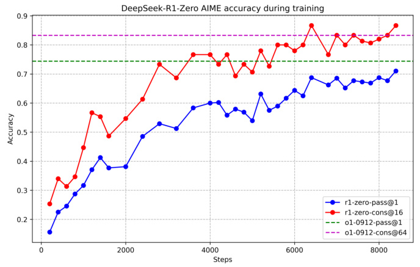
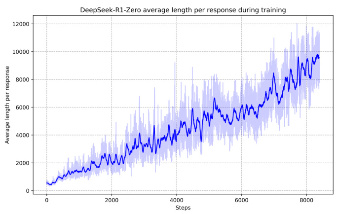

# Detailed Breakdown

## The Problem

Enhancing reasoning capabilities in large language models has traditionally required massive amounts of supervised training data and complex training pipelines. Previous approaches relied heavily on supervised fine-tuning (SFT) as a preliminary step before reinforcement learning, making the process resource-intensive and time-consuming. While models like OpenAI's o1 demonstrated breakthrough performance in reasoning tasks, they remained proprietary and closed-source, limiting access for the broader research community. Additionally, smaller models struggled to achieve comparable reasoning performance, creating a significant gap between large-scale proprietary models and accessible open-source alternatives.

## The Innovation

DeepSeek-R1 introduces a paradigm shift by demonstrating that **pure reinforcement learning** can elicit powerful reasoning capabilities without any supervised fine-tuning as a preliminary step. The core technical innovations include:

- **GRPO Algorithm**: Group Relative Policy Optimization eliminates the need for expensive critic models by estimating baselines from group scores, significantly reducing training costs
- **Self-Emergent Reasoning**: Models spontaneously develop sophisticated behaviors like self-verification, reflection, and long chain-of-thought generation through RL alone
- **Multi-Stage Pipeline**: A refined approach combining cold-start data with iterative RL and SFT stages to enhance both reasoning and general capabilities
- **Effective Distillation**: Reasoning patterns from large models can be effectively transferred to smaller dense models, outperforming direct RL training on small models

This approach fundamentally differs from previous methods by removing dependence on supervised data for initial reasoning capability development, instead allowing models to discover reasoning strategies autonomously through interaction with reward signals.

## How It Works

### 1. DeepSeek-R1-Zero: Pure RL Approach

The system starts with DeepSeek-V3-Base as the foundation model and applies GRPO reinforcement learning directly without any SFT preparation. The RL algorithm maximizes an objective function that optimizes policy model performance while maintaining KL divergence constraints:

$$\mathcal{J}_{\texttt{GRPO}}(\theta)=\mathbb{E}[q\sim P(\texttt{Q}),\{o_{i}\}_{i=1}^{G}\sim\pi_{\theta_{old}}(\texttt{O}|q)]$$

For each question, GRPO samples a group of outputs and optimizes the policy using group-based advantage estimation rather than requiring a separate critic model.

### 2. Reward System Architecture

The training employs a dual-component reward system:
- **Accuracy Rewards**: Rule-based verification for math problems using specified format boxes and compiler feedback for coding challenges
- **Format Rewards**: Enforcement of thinking process structure between special tags to ensure consistent output formatting

### 3. Self-Evolution Process

During RL training, the model naturally learns to allocate more thinking time, with response lengths increasing steadily as it discovers that extended computation improves performance. The model exhibits emergent behaviors including reflection, where it revisits and reevaluates previous steps, and exploration of alternative problem-solving approaches.

### 4. Enhanced DeepSeek-R1 Pipeline

To address readability and language mixing issues in DeepSeek-R1-Zero, the enhanced version incorporates:
- **Cold Start Data**: Thousands of long CoT examples with human-readable formatting patterns
- **Multi-Stage Training**: Two RL phases focusing on reasoning discovery and preference alignment, separated by SFT stages
- **Rejection Sampling**: Collection of high-quality reasoning trajectories from RL checkpoints
- **Comprehensive Data Integration**: Combination of reasoning data with writing, factual QA, and self-cognition examples

## Key Results

The experimental results demonstrate remarkable performance across multiple benchmarks:

- **AIME 2024**: DeepSeek-R1 achieves **79.8%** Pass@1, slightly surpassing OpenAI-o1-1217's 79.2%
- **MATH-500**: Attains **97.3%** performance, matching OpenAI-o1-1217 and significantly outperforming other models
- **Codeforces Rating**: Achieves **2,029 Elo** rating, outperforming 96.3% of human participants
- **MMLU-Pro**: Scores **84.0%**, significantly outperforming DeepSeek-V3's 75.9%
- **GPQA Diamond**: Achieves **71.5%**, demonstrating strong performance on graduate-level questions

For distilled models, the results are equally impressive:
- **DeepSeek-R1-Distill-Qwen-7B**: Achieves **55.5%** on AIME 2024, surpassing QwQ-32B-Preview
- **DeepSeek-R1-Distill-Qwen-32B**: Scores **72.6%** on AIME 2024 and **94.3%** on MATH-500
- **LiveCodeBench Performance**: **57.2%** for the 32B distilled model, comparable to o1-mini

## Practical Applications

### Mathematical Education and Tutoring
The models' exceptional performance on mathematical benchmarks enables advanced tutoring systems that can provide step-by-step solutions to complex problems, making high-quality math education more accessible.

### Software Development and Code Generation
With expert-level performance on coding competitions (Codeforces 96.3rd percentile), these models can assist developers with algorithm design, debugging, and code optimization tasks.

### Scientific Research and Analysis
Strong performance on reasoning benchmarks makes these models valuable for hypothesis generation, experimental design, and data analysis in scientific contexts.

### Content Creation and Analysis
High performance on creative writing and summarization tasks (87.6% win-rate on AlpacaEval 2.0) enables sophisticated content generation and document analysis applications.

## Limitations & Considerations

- **Language Mixing**: DeepSeek-R1 may mix languages when handling queries in languages other than English or Chinese, though language consistency rewards mitigate this issue
- **Prompt Sensitivity**: The model performs optimally with zero-shot prompting; few-shot examples tend to degrade performance
- **Software Engineering Tasks**: Limited improvement over DeepSeek-V3 on engineering benchmarks due to long evaluation times affecting RL efficiency
- **Function Calling Capabilities**: Currently falls short of DeepSeek-V3 in tasks like function calling, multi-turn conversations, and JSON output
- **General Capability Trade-offs**: Heavy focus on reasoning may slightly impact performance in other domains compared to more general-purpose models

## What This Means for Builders

### Immediate Opportunities

Developers can immediately leverage the open-source distilled models for building reasoning-powered applications without API costs. The availability of models from 1.5B to 70B parameters allows deployment across various hardware constraints, from edge devices to cloud infrastructure. The strong performance on mathematics and coding tasks enables creation of educational tools, programming assistants, and analytical applications.

### Implementation Pathway

The open-source nature of both the methodology and model checkpoints allows teams to fine-tune models for specific domains using their own data. The distillation approach enables companies to create specialized reasoning models for their particular use cases without requiring massive computational resources for training from scratch. The published training pipeline provides a blueprint for organizations to develop their own reasoning models tailored to industry-specific requirements.

### Strategic Implications

This breakthrough suggests a shift toward more autonomous AI development, where models can discover capabilities through interaction rather than explicit instruction. The success of pure RL indicates that future AI development may focus more on designing effective reward systems and training environments rather than collecting massive supervised datasets. The ability to distill reasoning capabilities into smaller models suggests that the intelligence gap between large and small models may be bridgeable through better training methodologies.

### Cost Optimization

The GRPO algorithm's elimination of critic models reduces training costs by approximately 50% compared to traditional RL approaches. The distillation strategy allows organizations to achieve reasoning performance comparable to much larger models at a fraction of the computational cost. For businesses, this means access to advanced AI reasoning capabilities without the massive infrastructure investments typically required for state-of-the-art performance, potentially reducing AI deployment costs by orders of magnitude while maintaining competitive performance levels.