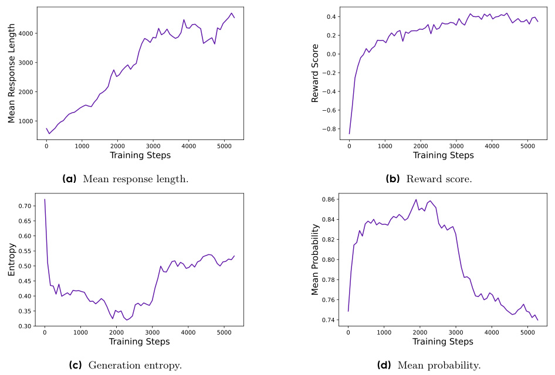

# Detailed Breakdown

## The Problem

Large language models have demonstrated remarkable capabilities in natural language understanding and generation, but they continue to struggle with complex mathematical reasoning and problem-solving tasks. While state-of-the-art systems like OpenAI's o1 and DeepSeek's R1 have shown impressive performance on challenging mathematical competitions like AIME (American Invitational Mathematics Examination), the technical details behind their success remain closely guarded secrets. This lack of transparency creates a significant barrier for researchers attempting to reproduce these results, with typical naive implementations achieving only 30 points on AIME 2024 compared to DeepSeek's reported 47 points. The community faces several critical challenges that prevent successful large-scale reinforcement learning deployment: entropy collapse where models become too deterministic and lose exploration capabilities, reward noise that confuses the learning process, training instability that can derail entire training runs, and poor sample efficiency that makes training prohibitively expensive.

## The Innovation

DAPO (Decoupled Clip and Dynamic sAmpling Policy Optimization) represents a fundamental breakthrough in reinforcement learning for large language models, introducing four key technical innovations that address the core challenges of long-chain-of-thought reasoning:

- **Asymmetric Clipping Strategy**: Traditional PPO uses symmetric clipping ranges (ε=0.2) that equally restrict exploration and exploitation. DAPO decouples these into separate ε_low (0.2) and ε_high (0.28) parameters, allowing low-probability exploration tokens more room to grow while maintaining stability for high-probability exploitation tokens.

- **Dynamic Sampling with Filtering**: Instead of processing all training samples equally, DAPO dynamically samples and filters out prompts with perfect accuracy (all responses correct) or zero accuracy (all responses wrong), ensuring that every training batch contains meaningful gradient signals and maintains consistent training efficiency.

- **Token-Level Policy Gradient Loss**: Unlike GRPO's sample-level loss averaging that unfairly weights short and long sequences, DAPO uses token-level loss computation where each token contributes equally to the overall loss, preventing unhealthy entropy growth and enabling more balanced learning across different solution lengths.

- **Intelligent Overlong Reward Shaping**: DAPO addresses reward noise from truncated solutions by implementing a soft punishment mechanism that gradually increases penalties for overly long responses, providing clearer learning signals while avoiding confusion between good reasoning and excessive length.

## How It Works

The DAPO algorithm operates through a sophisticated multi-stage training process that transforms a base language model into a powerful mathematical reasoning system:

1. **Initialization and Sampling**: The system starts with a base policy model π_θ and samples multiple responses for each question. For every question q in a batch, DAPO generates G responses using the current policy, creating diverse solution attempts that will be evaluated and used for learning.

2. **Reward Computation and Filtering**: Each generated response receives a rule-based reward (1 for correct, -1 for incorrect) using exact answer matching. The dynamic sampling mechanism then filters out questions where all responses are correct or all are incorrect, ensuring only questions with mixed success rates proceed to training.

3. **Advantage Estimation**: For the remaining responses, DAPO computes advantages using group-relative normalization, comparing each response's reward to the mean and standard deviation of its group. This provides a relative measure of which responses performed better than expected.

4. **Policy Optimization with Asymmetric Clipping**: The core DAPO objective maximizes a clipped surrogate function with different upper and lower bounds. This prevents large policy updates for exploitation tokens while allowing more aggressive updates for exploration tokens, maintaining a healthy balance between exploring new reasoning patterns and exploiting successful ones.

5. **Token-Level Loss Computation**: Unlike traditional approaches that average losses at the sample level, DAPO computes losses at the token level and then aggregates across all tokens. This ensures that longer, more complex solutions contribute proportionally to the learning signal based on their actual content rather than being diluted by sample averaging.

The training process involves multiple gradient updates per rollout step, with careful monitoring of entropy, response length, and reward dynamics to ensure stable and efficient learning.

## Key Results

The experimental results demonstrate DAPO's effectiveness across multiple dimensions:

- **State-of-the-Art Performance**: Achieved **50 points on AIME 2024** using Qwen2.5-32B base model, surpassing DeepSeek-R1-Zero-Qwen-32B's 47 points while using only **50% of the training steps**

- **Progressive Improvements**: Each technique contributed meaningful gains: Naive GRPO (30 points) → Overlong Filtering (36 points) → Clip-Higher (38 points) → Soft Overlong Punishment (41 points) → Token-level Loss (42 points) → Dynamic Sampling (50 points)

- **Training Efficiency**: Dynamic sampling, despite requiring more samples due to filtering, actually reduced overall training time because of faster convergence and fewer required training steps

- **Stability Improvements**: The combination of techniques prevented entropy collapse, maintained healthy response lengths, and provided more stable training dynamics compared to baseline approaches

- **Emergent Behaviors**: During training, the model spontaneously developed reflective and self-correction behaviors that were not present in the initial training data, demonstrating the algorithm's ability to induce sophisticated reasoning patterns

The evaluation setup used avg@32 (averaging across 32 different response generations) for stability, with inference parameters set to temperature 1.0 and top-p 0.7. Training used AdamW optimizer with learning rate 1×10^-6, batch size 512, and 16 responses per prompt.

## Practical Applications

### Mathematical Education and Tutoring

DAPO enables the creation of advanced AI tutoring systems that can solve complex mathematical problems while showing detailed reasoning steps. These systems can provide personalized learning experiences, adapting their explanations to different learning styles and offering hints when students struggle with specific concepts.

### Scientific Research and Discovery

The algorithm's ability to develop complex reasoning chains makes it valuable for scientific research applications, including automated theorem proving, hypothesis generation, and data analysis. Researchers can leverage DAPO-powered systems to explore mathematical relationships and validate conjectures across various scientific domains.

### Competitive Programming and Problem Solving

DAPO's success on mathematical competitions translates directly to competitive programming and complex problem-solving scenarios. The system can be integrated into development tools to suggest algorithmic approaches, optimize solutions, and identify edge cases in software development.

### Financial Modeling and Risk Analysis

The sophisticated reasoning capabilities developed through DAPO training can be applied to financial modeling, risk assessment, and quantitative analysis tasks that require complex mathematical reasoning and multi-step problem solving.

### Engineering Design and Optimization

DAPO-powered systems can assist in engineering design processes, helping to optimize complex systems, perform calculations, and identify design trade-offs across multiple constraints and requirements.

## Limitations & Considerations

- **Mathematical Domain Focus**: Current evaluation primarily focuses on mathematical reasoning tasks; performance on other reasoning domains (logical reasoning, causal inference) requires further investigation

- **Computational Requirements**: While more efficient than previous approaches, DAPO still requires significant computational resources for training large models (32B parameters) with reinforcement learning

- **Reward Dependency**: The system currently relies on rule-based rewards for mathematical problems; extending to domains without clear evaluation criteria requires reward model development

- **Dataset Requirements**: The current implementation uses a carefully curated mathematical dataset (DAPO-Math-17K); quality and diversity of training data significantly impact final performance

- **Hyperparameter Sensitivity**: The asymmetric clipping parameters (ε_low=0.2, ε_high=0.28) and other hyperparameters may require tuning for different model architectures or task domains

- **Training Complexity**: The multi-component nature of DAPO (four key techniques) increases implementation complexity compared to simpler baseline approaches

## What This Means for Builders

### Immediate Opportunities

Developers can immediately leverage DAPO's open-source implementation to build mathematical reasoning capabilities into their applications. The fully released codebase, dataset, and training scripts provide a complete foundation for creating specialized AI systems without needing to reverse-engineer proprietary approaches. Companies in education, finance, and scientific computing can integrate DAPO-powered components to enhance their existing products with advanced reasoning capabilities.

### Implementation Pathway

The DAPO system is built on the verl framework and provides a complete training pipeline that can be adapted for different base models and domains. Developers can start with the released Qwen2.5-32B checkpoint and fine-tune it for specific applications, or use the training code to train their own models using custom datasets. The modular design allows selective adoption of individual techniques based on specific requirements and computational constraints.

### Strategic Implications

DAPO represents a shift toward democratized access to advanced AI reasoning capabilities, potentially changing the competitive landscape for AI products requiring sophisticated problem-solving. The open-source nature may accelerate innovation in mathematical AI applications and reduce the barrier to entry for companies wanting to build reasoning-intensive products. This could lead to proliferation of specialized AI assistants across scientific, educational, and professional domains.

### Cost Optimization

The improved sample efficiency and reduced training requirements make advanced reasoning AI more economically viable for organizations without massive research budgets. The 50% reduction in required training steps significantly lowers computational costs, while the open-source nature eliminates licensing fees associated with proprietary solutions. This makes sophisticated AI reasoning capabilities accessible to a much broader range of organizations and use cases.