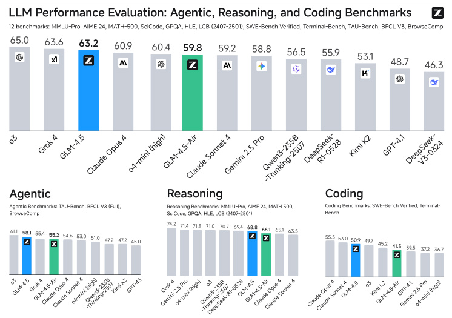

# Detailed Breakdown

## The Problem

The field of large language models has reached a critical juncture where models must evolve from general knowledge repositories into genuine problem-solvers capable of human-level cognitive performance across diverse domains. This evolution requires unified mastery of three interconnected capabilities: Agentic abilities for interacting with external tools and real-world systems, complex Reasoning for solving multi-step problems in mathematics and science, and advanced Coding skills for tackling real-world software engineering tasks. While proprietary models like OpenAI's o1/o3 and Anthropic's Claude Sonnet 4 have demonstrated groundbreaking performance in specific ARC domains, the research community has lacked a single, powerful open-source model that excels across all three areas simultaneously. This gap has limited the ability of researchers and developers to build sophisticated applications that require integrated capabilities across reasoning, tool use, and code generation.

Current open-source models face several critical limitations: inefficient parameter usage with high computational costs, difficulty generalizing across different task domains, and the absence of hybrid reasoning modes that can adapt processing depth based on task complexity. The challenge is particularly acute for models that need to handle both quick responses (like customer service interactions) and deep reasoning (like mathematical problem-solving) within the same system. Furthermore, existing models often struggle with long-context understanding, complex tool calling scenarios, and maintaining performance across different languages and cultural contexts.

## The Innovation

GLM-4.5 introduces several fundamental breakthroughs that differentiate it from previous approaches:

- **Hybrid Reasoning Architecture**: The model features both thinking mode for complex reasoning and agentic tasks, and non-thinking mode for instant responses, automatically determining which approach to use based on task complexity.
- **Parameter-Efficient MoE Design**: With 355B total parameters but only 32B activated parameters, GLM-4.5 achieves superior computational efficiency compared to competitors like DeepSeek-R1 (671B parameters) and Kimi K2 (1043B parameters).
- **Expert Model Iteration Training**: A novel post-training approach that creates specialized expert models for different domains (Reasoning, Agent, General chat) and then distills their capabilities into a unified model through self-distillation techniques.
- **Advanced MoE Architecture Optimization**: Unlike DeepSeek-V3 and Kimi K2, GLM-4.5 reduces model width (hidden dimension and number of routed experts) while increasing height (number of layers), resulting in better reasoning capacity with fewer parameters.

The core innovation lies in the systematic approach to unifying different AI capabilities that have traditionally been developed separately. The multi-stage training process begins with general pre-training on 23T tokens, followed by specialized mid-training stages for reasoning and agentic capacity enhancement, and culminates in expert model iteration post-training. This comprehensive approach allows the model to develop both deep expertise in specific domains and the flexibility to apply appropriate reasoning strategies across different task types.

## How It Works

1. **Multi-Stage Pre-Training Architecture**:
   - **Stage 1**: Training on general documents from webpages with 4K sequence length
   - **Stage 2**: Up-sampling source code, mathematics, and science content with extended 128K sequence length
   - **Mid-Training Phases**: Repo-level code training, synthetic reasoning data training, and long-context & agent training

2. **Mixture-of-Experts Architecture**:
   - **Loss-Free Balance Routing**: Employs sigmoid gates for MoE layers with optimized load balancing strategies
   - **Attention Optimization**: Uses Grouped-Query Attention with partial RoPE and 2.5x more attention heads (96 heads for 5120 hidden dimension)
   - **QK-Norm Implementation**: Stabilizes attention logits range for improved training stability

3. **Expert Model Iteration Framework**:
   - **Stage 1 (Expert Training)**: Creates specialized models for Reasoning, Agent, and General chat domains
   - **Stage 2 (Unified Training)**: Distills multiple expert capabilities into one hybrid reasoning model using self-distillation techniques
   - **Cold Start SFT**: Provides foundational capabilities with extended Chain-of-Thought responses
   - **Overall SFT**: Collects millions of samples across task domains and balances training data with and without explicit reasoning processes

4. **Advanced Reinforcement Learning Pipeline**:
   - **Reasoning RL**: Uses difficulty-based curriculum learning and single-stage 64K output length training
   - **Agentic RL**: Implements outcome supervision with process action format penalties and iterative self-distillation
   - **General RL**: Combines rule-based feedback, human feedback (RLHF), and model-based feedback (RLAIF)

The training infrastructure (Slime framework) supports both synchronous and asynchronous training modes, with specialized optimizations for different types of RL tasks. For agentic tasks, the system uses a disaggregated, asynchronous model with high-concurrency Docker-based runtime, while for reasoning tasks it employs a synchronous, colocated architecture for maximum efficiency.

## Key Results

GLM-4.5 demonstrates exceptional performance across comprehensive evaluation benchmarks:

- **Agentic Performance**: Achieved **70.1% on TAU-Bench** and **77.8% on BFCL v3**, outperforming GPT-4.1 and matching Claude Sonnet 4 in function calling capabilities
- **Reasoning Excellence**: Scored **91.0% on AIME 24** (outperforming o3), **79.1% on GPQA**, **72.9% on LiveCodeBench**, and **14.4% on HLE** (Humanity's Last Exam)
- **Coding Mastery**: Achieved **64.2% on SWE-bench Verified** and **37.5% on Terminal-Bench**, outperforming GPT-4.1 and Gemini-2.5-pro
- **Parameter Efficiency**: With only half the parameters of DeepSeek-R1 and one-third of Kimi K2, GLM-4.5 ranks 3rd overall among all evaluated models and 2nd specifically on agentic benchmarks

![4dea1da644c383228be3850d39432f61.jpg)

The model also demonstrated strong performance in human evaluations, scoring 8.66 on English prompts, 8.37 on Chinese prompts, and 8.49 on other language prompts, outperforming DeepSeek-R1-0528 and Kimi K2 across all categories. In coding agent evaluations, GLM-4.5 achieved a **90.6% tool calling success rate**, the highest among all tested models including Claude Sonnet 4.

## Practical Applications

### Autonomous AI Agents
GLM-4.5's strong agentic capabilities enable the development of sophisticated autonomous agents that can interact with external tools, browse the web for information, and execute complex multi-step tasks. The model's 26.4% performance on BrowseComp demonstrates its ability to find correct answers for complicated questions through web browsing, making it suitable for customer service agents, research assistants, and information gathering systems.

### Advanced Code Generation and Software Engineering
With exceptional performance on SWE-bench Verified (64.2%) and Terminal-Bench (37.5%), GLM-4.5 can handle real-world software engineering tasks including debugging, code modification, and system administration. The model's repo-level code training enables it to understand cross-file dependencies and work with existing codebases effectively.

### Mathematical and Scientific Reasoning
The model's outstanding performance on mathematical benchmarks (91.0% on AIME 24, 98.2% on MATH 500) and scientific reasoning tasks (41.7% on SciCode, 79.1% on GPQA) makes it ideal for educational applications, research assistance, and complex problem-solving in STEM fields.

### Multilingual Translation and Communication
GLM-4.5 significantly outperforms specialized translation models on challenging real-world cases, scoring 1.71 on human evaluation compared to 0.65 for the best specialized model. Its ability to understand cultural context, internet slang, and domain-specific terminology enables nuanced translation for global communication platforms.

### Long-Context Document Analysis
The model's 128K context length and specialized training enable comprehensive analysis of long documents, making it suitable for legal document review, research paper analysis, and large-scale content summarization tasks.

## Limitations & Considerations

- **Computational Requirements**: Despite parameter efficiency, the 355B parameter model still requires substantial computational resources for training and inference
- **Performance Variability**: While strong across domains, performance varies between different task types, with some benchmarks (like HLE at 14.4%) showing room for improvement
- **Safety Considerations**: The model achieves 89.9% on SafetyBench but shows lower performance in addressing Unfairness and Bias (77.4%), indicating ongoing challenges in safety alignment
- **Context Window Limitations**: While supporting 128K context, the model may still struggle with extremely long documents that exceed this limit
- **Implementation Complexity**: The multi-stage training process and expert model iteration approach require sophisticated infrastructure and expertise to implement effectively

The model's performance on certain benchmarks suggests that while it excels at many tasks, there are still areas where further improvement is needed, particularly in handling extremely complex reasoning problems and ensuring consistent safety alignment across all domains.

## What This Means for Builders

### Immediate Opportunities
Developers can immediately leverage GLM-4.5's open-source nature to build applications that previously required expensive proprietary APIs. The model's strong performance across agentic, reasoning, and coding tasks enables the creation of comprehensive AI solutions without the need to integrate multiple specialized models. The availability of both GLM-4.5 (355B parameters) and GLM-4.5-Air (106B parameters) provides flexibility for different deployment scenarios and resource constraints.

### Implementation Pathway
The open-source release includes model weights, evaluation toolkit, and comprehensive documentation available at https://github.com/zai-org/GLM-4.5. Developers can access the models through Z.ai, BigModel.cn, or Hugging Face. The multi-stage training approach and expert model iteration framework provide a clear roadmap for organizations looking to adapt the model to specific domains or improve performance on particular tasks. The Slime RL infrastructure is also available for organizations implementing their own reinforcement learning pipelines.

### Strategic Implications
GLM-4.5's success represents a significant step toward democratizing access to state-of-the-art AI capabilities, potentially accelerating innovation across the AI ecosystem. The model's parameter efficiency and strong performance suggest that future AI development may focus more on architectural innovations and training strategies rather than simply scaling model size. The hybrid reasoning approach could become a standard paradigm for future language models, enabling more efficient and adaptable AI systems.

### Cost Optimization
The MoE architecture with only 32B activated parameters out of 355B total parameters provides significant computational cost savings compared to dense models of equivalent capability. This efficiency, combined with the model's strong performance across multiple domains, means organizations can potentially replace multiple specialized models with a single GLM-4.5 instance, reducing infrastructure complexity and operational costs while maintaining high performance across diverse use cases.